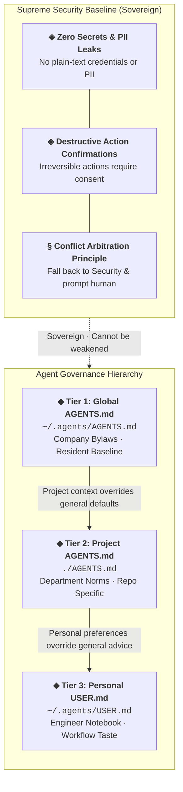

In Stephen Chow’s classic martial-arts comedy *Shaolin Soccer*, there is an unforgettable line: **"Without dreams in life, how are you any different from a salted fish?"**

In modern software development where human engineers pair program with AI agents, uncalibrated agents often behave exactly like **amnesiac salted fishes**:
- **Context Amnesia**: You painstakingly align on architecture boundaries in one session, but open a new terminal tab and the agent forgets everything. Switch between CLI tools and you start from ground zero all over again.
- **Tone-Deaf to Risk**: Agents happily print production database tokens or customer PII directly into terminal logs, or blindly trigger irreversible destructive commands.
- **Repeatedly Tripping on the Same Rakes**: Last week's obscure library bug gets encountered again this week under a slightly rephrased prompt.
- **Confidently Hallucinating**: Agents recite deprecated flags and non-existent APIs with absolute conviction.

Instead of restarting the onboarding dance with every new conversation, we can codify our team standards, safety constraints, and engineering taste into a unified "onboarding playbook." This post explores how my **hierarchical global `AGENTS.md` architecture** ensures every agent begins from your personal baseline.

---

## Evolutionary Roots: Context Engineering on the Shoulders of Giants

This architecture was not conceived in a vacuum. It evolved through countless real-world pair programming friction points, synthesized from three pivotal pieces of community and official literature:

1. **Community Pragmatism: [@Mnilax's 12 Rules for CLAUDE.md](https://x.com/mnilax/status/2053116311132155938)**  
   Exposed the anti-pattern of turning instruction files into indiscriminate dumping grounds: rules must be concise, non-derivable from the existing codebase, and governed by ownership—placed exactly where whoever would break them must pass—eliminating verbose transcripts and cognitive noise.
2. **Official Session Discipline: [Anthropic's Maximizing the Value of Your Claude Code Sessions](https://claude.com/blog/maximizing-the-value-of-your-claude-code-sessions)**  
   Highlighted session lifecycle governance and the hidden cost of context contamination: keeping primary context windows lean, delivering modular outcomes, utilizing strategic resets, and delegating heavy exploration so ephemeral debugging logs never overwhelm durable instructions.
3. **Frontier Context Engineering: [The New Rules of Context Engineering](https://claude.com/blog/the-new-rules-of-context-engineering-for-claude-5-generation-models)**  
   Established the context engineering paradigm for frontier models—**progressive disclosure and just-in-time context mounting**: rather than frontloading 3,000 lines of static rules and triggering attention dilution, systems should maintain a lean resident spine and dynamically awaken topic-specific rules only upon relevant triggers.

Synthesizing these insights yielded a multi-tool, safety-first, context-efficient tiered governance architecture.

---

## 1. Core Architectural Philosophy

Building a resilient agent governance system requires balancing three fundamental engineering forces:

> **Non-Negotiable Safety (Safe) ✕ Minimal Context Footprint (Context-Efficient) ✕ Explicit Ownership (Ownership)**

1. **Single Source of Truth (SSOT)**: Maintain `~/.agents/AGENTS.md` as the supreme baseline across your entire machine, ensuring every agent reads the identical playbook.
2. **Symlinks Across Multi-Tool Ecosystems**: Avoid duplicating instructions across competing vendor folders. While Copilot CLI reads `~/.agents/AGENTS.md` natively, other tools bridge via clean symlinks:
   ```bash
   mkdir -p ~/.claude ~/.codex ~/.gemini
   ln -s ~/.agents/AGENTS.md ~/.claude/CLAUDE.md
   ln -s ~/.agents/AGENTS.md ~/.codex/AGENTS.md
   ln -s ~/.agents/AGENTS.md ~/.gemini/GEMINI.md
   ```
3. **Vendor-Agnostic Syntax**: Keep the root instruction file free of vendor-specific XML tags or tool-bound syntax sugars to guarantee predictable parsing across LLM providers.

---

## 2. Three-Tier Precedence & Conflict Adjudication

Like any well-governed engineering organization, guidelines must have clear jurisdictional tiers and unambiguous arbitration rules:



### Precedence Rules
- **Project rules** override global defaults.
- **Personal preferences** (`USER.md`) can override general advice and suggestions.
- **The Constitutional Red Line**: Neither project rules nor personal preferences may **weaken or compromise the Security rules**. When rules conflict, agents must **abort the assumption, fall back to the Security baseline, and ask the human for clarification**.

---

## 3. The Security Red Line: "Actually, I Am an Officer"

In Stephen Chow's *King of Comedy*, the protagonist famously reminds everyone, "Actually, I am an actor." In an autonomous agent system, the Security rule plays the quiet undercover officer who saves the entire project during high-stakes moments.

- **Zero Secret / PII Leaks**: Strictly prohibit outputting, displaying, logging, or forwarding unmasked credentials or customer PII.
  - *PII threshold*: Masking preserves business analytical value (e.g. referencing "Customer Mr. Wang"); as long as individual identity is unidentifiable, the agent may proceed autonomously.
  - *Secret threshold*: Masking a secret destroys its utility, leaving only narrow identification (e.g. "the key ending in `XY27`"). If raw credentials are required, **explicit human consent is mandatory**.
- **Destructive Operation Gates**: Irreversible operations (such as `git reset --hard`, bulk deletions, or database truncations) require mandatory human confirmation.

---

## 4. Resident Framework vs. On-Demand Topic Rules

Many teams dump 3,000 lines of prose directly into their system prompt, exhausting precious context window space and degrading the model's reasoning capabilities through attention dilution.

Our solution is **a minimal resident framework paired with on-demand dynamic mounting**:

- **Resident Core (`~/.agents/AGENTS.md`)**: Houses only lean, universal directives—Precedence, the Security red line, explicit memory persistence (only remember when explicitly instructed), and external verification (never hallucinate time-sensitive version numbers).
- **Topic-Scoped Rules (`~/.agents/rules/*.md`)**: Remain out of context by default. Mounted only when specific condition triggers fire:
  - `sensitive-data.md`: Awakens when touching credentials or customer records.
  - `coding.md`: Activated when authoring software, establishing arbitration priorities: Safety/Correctness → Codebase Conformance → Simplicity → Taste.
  - `subagents.md`: Offloads context-heavy tasks (repo scanning, raw log parsing) to subagents on cheaper models, returning only the synthesized conclusion to the main thread.
  - `skills.md` & `contact.md`: Govern missing skill installations and urgent off-session human notifications.

---

## Conclusion

In the fast-evolving agentic coding frontier, lasting competitive advantage is not about remembering magical prompts. It is about constructing durable boundaries, security guardrails, and sovereign architectures for your digital workforce.

**Instead of re-explaining the basics in every chat, write down your principles. Let every amnesiac salted fish begin from your standard.**

---

## References

- [My Global Agent Instructions (GitHub Gist)](https://gist.github.com/akunzai/c6c90c01a07eba50d26514ce676eaa40) — Open-source reference implementation of global `AGENTS.md`, `rules/`, and `USER.md`
- [GitHub: akunzai/agent-skills](https://github.com/akunzai/agent-skills) — Curated collection of engineering skills for AI coding agents
- [GitHub: akunzai/skills-manager](https://akunzai.github.io/skills-manager/) — Cross-platform declarative skill management CLI for AI agents
- [12 Rules for CLAUDE.md by @Mnilax](https://x.com/mnilax/status/2053116311132155938) — Foundational community framework on prompt optimization
- [Anthropic: Maximizing the Value of Your Claude Code Sessions](https://claude.com/blog/maximizing-the-value-of-your-claude-code-sessions) — Official best practices on context management and session discipline
- [Anthropic: The New Rules of Context Engineering](https://claude.com/blog/the-new-rules-of-context-engineering-for-claude-5-generation-models) — Foundational principles for attention budget and context curation in next-generation models
