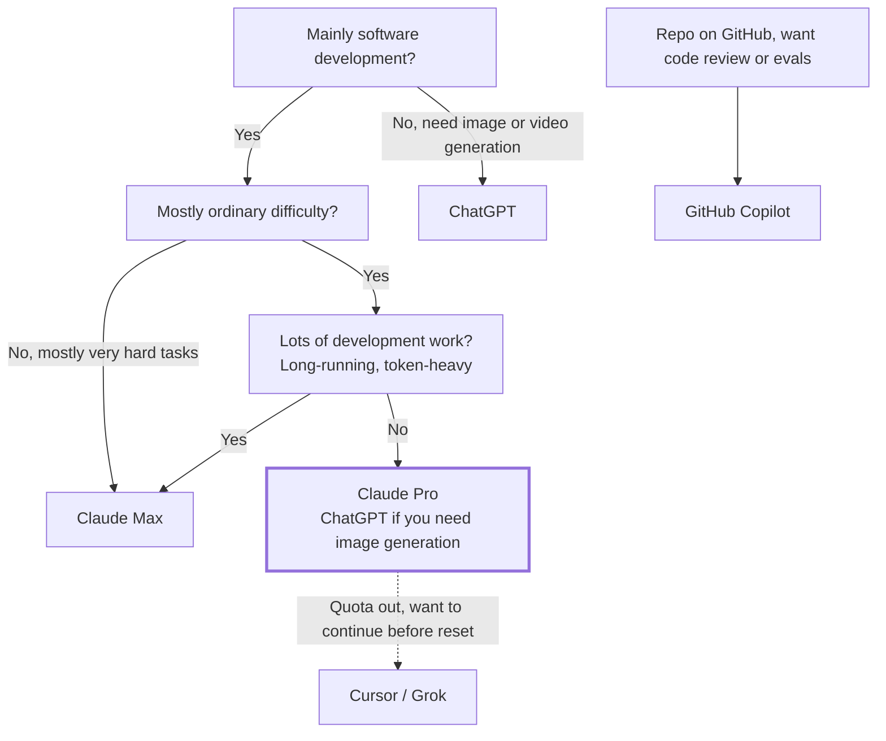

:::note[Token Value Maxxing series: a side story]
This post isn't about saving tokens but about how much to pay for them. For saving tokens, see the [series overview](/en/blog/token-value-maxxing/).
:::

In Stephen Chow's *King of Comedy*, Cuckoo asks Wan Tin-sau what they'll do from here, and he answers: "**I'll take care of you.**"

After I subscribed to Max, Anthropic told me the same thing. Then I started working overtime.

---

## The Bill First: $5,355 in One Month

I am on Claude Max 5x ($100 a month), and my billing cycle ran from 8/27 to 9/27. Below is Claude usage on my two machines over the most recent 30 days, which roughly overlap that cycle, **priced at API list rates** (not what I paid; I paid only the subscription fee):

| Model | Machine A | Machine B | Total |
|---|---:|---:|---:|
| Claude Opus 5 | $2,959.75 | $684.50 | $3,644.25 |
| Claude Opus 5.5 | $130.29 | $593.70 | $723.99 |
| Claude Opus 4.7 | $243.43 | — | $243.43 |
| Claude Sonnet 5 | $446.40 | $254.78 | $701.18 |
| Claude Fable 5.1 | $38.80 | — | $38.80 |
| Claude Haiku 4.5 | $1.90 | $1.63 | $3.53 |
| **Total** | **$3,820.56** | **$1,534.61** | **$5,355.17** |

Three things stand out:

1. **The Opus family accounts for 86%.** It's the model I use most and like best.
2. **The most expensive model, Fable 5.1, is under 1%.** I barely had tasks that needed it.
3. **Opus 5.5 shipped on 9/22**, and in its one week it caught up with a full month of Sonnet 5.

---

## How Big Is the Subsidy: SemiAnalysis's Measurements

[SemiAnalysis's report from 10/5](https://newsletter.semianalysis.com/p/anthropic-subscriptions-offer-5x) measures what each subscription is worth at API list prices when fully used. The table below covers the mid-tier models (Opus 5.5 on Claude, GPT-6.1 Sol on ChatGPT) under an agentic workload in which 96.6% of tokens are cache reads:

| Plan | Monthly fee | Tokens per month | API equivalent at full use | Multiple |
|---|---:|---:|---:|---:|
| Claude Pro | $20 | 2.9B | ~$1,178 | 59× |
| Claude Max 5x | $100 | 14.0B | ~$5,725 | 57× |
| ChatGPT Plus | $20 | 1.0B | ~$211 | 11× |
| ChatGPT Pro 100 | $100 | 5.1B | ~$1,055 | 11× |

The multiple is "API equivalent at full use ÷ monthly fee": the most API value the plan can give, assuming you use up every weekly limit on the model in the table. The value you actually get is that multiple times your own utilization.

Tokens count input, cache reads, cache writes, and output, in a 0.4% / 96.6% / 2.6% / 0.3% mix. That works out to about 140M tokens per dollar on Claude and 51M on ChatGPT; the $200 plans match, with 28.6B on Max 20x and 10.2B on ChatGPT Pro 200.

API-equivalent value is "tokens you can use × API list price", so it moves with model pricing: when OpenAI shipped GPT-6.1 Sol it cut the cache-read price without raising Sol's token limits, so the same allowance became worth about 30% less. Dollar figures from different dates or models aren't directly comparable; token counts don't move with list prices, so they're the better yardstick for your own usage.

For the same fee, Claude gives more than 5 times ChatGPT's API-equivalent value. After OpenAI halved its $200 plan's limits on 9/29, every ChatGPT plan offers the same value per dollar as the $100 plan; Anthropic's plans already did. ChatGPT's only counterpoint is that its Pro plans have no 5-hour limit, which makes the monthly allowance easier to use up. Also, Fable 5.1 can use at most 50% of a Claude plan's limit.

The report assumes API list prices carry a 92% gross margin, so the cost to serve is about 8% of list. Under that assumption, maxing out the limit on Opus 5.5 alone means a gross margin of about −369%; at 20% average utilization, it's about 6%.

By that math, serving me this month cost roughly $5,355 × 8% ≈ **$428**, and I paid $100. **I'm the one being subsidized.** That's also why leaving quota unused felt like a waste.

By dollars, $5,355 is about 94% of a fully used Max 5x, but most of it is Opus 5 at its higher list price, so tokens are the more accurate measure. Across both machines I used about 10.2B tokens (6.4B on machine A, 3.8B on machine B), about 73% of a fully used Max 5x, including the one-time quota reset that shipped with Opus 5.5. Models draw down the limit at different rates, so both ratios are estimates, but the conclusion is the same: I used most of the allowance this month. Over 95% of the tokens on both machines were cache reads, close to the report's workload, so the comparison roughly holds. For keeping the hit rate high, see [part 2](/en/blog/cache-session-habits/).

The report also warns that providers can change limits silently: one of three accounts on the same plan had about 20% lower limits, which the provider confirmed was an A/B test.

---

## Compare Models First: Capability and Cost at `medium`

Beyond API rates, I want to know what models can do and what they spend on tasks. I use **`medium` effort** throughout Artificial Analysis Intelligence Index v4.3.2. This matches the Claude Code default for Opus 5.5 and Sonnet 5.5 and avoids using maximum-effort scores and costs to infer everyday usage. Figures were checked on 2026-09-30; Sonnet 5, GPT-5.6 Sol, and GPT-6 Sol are included as previous-generation baselines. The results come from the evaluation pages for [Opus 5.5](https://artificialanalysis.ai/models/releases/claude-opus-5-5), [Sonnet 5](https://artificialanalysis.ai/models/releases/claude-sonnet-5), [Sonnet 5.5](https://artificialanalysis.ai/models/releases/claude-sonnet-5-5), [GPT-5.6 Sol](https://artificialanalysis.ai/models/releases/gpt-5-6-sol), [GPT-6 Sol](https://artificialanalysis.ai/models/releases/gpt-6-sol), [GPT-6 Astra](https://artificialanalysis.ai/models/releases/gpt-6-astra), and [GPT-6.1 Sol](https://artificialanalysis.ai/models/releases/gpt-6-1-sol):

| Model (all at `medium`) | Intelligence Index | Cost per task |
|---|---:|---:|
| Claude Opus 5 | 45 | $2.19 |
| Claude Opus 5.5 | 51 | $1.34 |
| Claude Sonnet 5 | 28 | $1.00 |
| Claude Sonnet 5.5 | 41 | $0.59 |
| GPT-6 Astra | 50 | $1.54 |
| GPT-5.6 Sol | 39 | $0.50 |
| GPT-6 Sol | 40 | $0.25 |
| GPT-6.1 Sol | 48 | $0.21 |

Across generations, Sonnet 5.5 gains 13 points over Sonnet 5 while costing 41% less per task; GPT-6.1 Sol gains 8 points over GPT-6 Sol while costing 16% less. Compared with GPT-5.6 Sol, which I used before canceling, GPT-6 Sol gains only 1 point but halves the cost; GPT-6.1 Sol gains 9 points while costing 58% less. Both newer model families are more capable and cheaper at the setting named `medium`, though that does not imply equal compute budgets.

At `medium`, GPT-6.1 Sol scores 7 points above Sonnet 5.5 and costs about 64% less per task. It trails Opus 5.5 by 3 points while costing about 84% less. The next rung up, Astra, scores 2 points above Sol at about 7.3 times the cost; Opus scores 1 point above Astra while costing about 13% less. **On these evaluations, Sol looks like it could cover both the middle rung and the workhorse role in Codex; Opus retains an advantage when more capability is needed.** At the same `medium` setting, Sonnet costs about 56% less than Opus but trails it by 10 points, supporting my choice to use Sonnet for well-scoped work and Opus for complex tasks.

Two caveats remain. First, each provider defines its own `medium` effort level, so the label does not imply an equal compute budget; the Opus 5.5 and Sonnet 5.5 results also include default fallback, whereas Sonnet 5 is labeled Adaptive Reasoning, Medium Effort. Second, cost per task is a weighted average of evaluation costs for input, cache reads and writes, reasoning, and answer tokens, calculated using task counts and index weights. It is not cost per successful task and cannot be converted directly into subscription quota. The overall index is also no substitute for your own development tasks; SemiAnalysis says outright that it doesn't consider these benchmark tasks representative of real work. Sol shipped only a day ago and I haven't used it enough, so I'd keep cross-module refactors on Opus for now.

Beyond scores and cost per task, I would compare how long the same work takes and how often it needs rework. A cheaper model may offer less value if it needs frequent corrections or retries. For a subscription, the most useful comparison is still to run the same everyday tasks and see which model finishes reliably while making the quota last longer.

---

## Choosing a Provider

### Claude: Opus Is the Workhorse in the Middle

Per [Claude's official pricing](https://platform.claude.com/docs/en/about-claude/pricing), Opus 5.5, released on 9/22, is cheaper than Opus 5:

| Model | Input | Output | Cache read |
|---|---:|---:|---:|
| Claude Fable 5.1 | $10 | $50 | $0.25 |
| Claude Opus 5 | $5 | $25 | $0.50 |
| **Claude Opus 5.5** | **$4** | **$20** | **$0.20** |
| Claude Sonnet 5.5 | $2 | $10 | $0.10 |

(USD per million tokens)

Opus cache reads dropped from $0.50 to $0.20. [On October 7](https://www.anthropic.com/claude-haiku-5-5), Sonnet 5.5 cache reads fell further to $0.10, so **Sonnet now costs half as much as Opus on cache reads**. In coding-agent work, cache reads are usually the bulk: of machine A's 6.4B tokens over these 30 days, 6.2B were cache reads. This strengthens the case for Sonnet on tasks it can finish reliably; it does not establish the same ratio for total task cost.

My observation: for typical in-house software development, Opus is enough. Reaching for the most expensive model is like firing a cannon at a sparrow; unless the task is genuinely hard, I don't recommend it as the default. For which task gets which model, see [part 3](/en/blog/subagent-model-selection/).

Since Sonnet 5.5 shipped, I switch by task: Sonnet 5.5 for well-scoped work whose result can be checked automatically (small projects, single-point edits, documents); Opus 5.5 stays the default for cross-module refactors, legacy-framework upgrades, and large projects with thin test coverage. On effort, both default to `medium` in Claude Code; Sonnet 5.5's levels are recalibrated, so don't carry over Sonnet 5 settings.

**Update, 2026-10-08:** [The Haiku 5.5 announcement](https://www.anthropic.com/claude-haiku-5-5) also introduces monthly Claude Platform API credits, rolling out this week: $100 for Max 5x, $200 for Max 20x, and up to $500 pooled across Team users. These are separate from the Claude Code subscription usage analyzed above; I have not included them in those historical totals or subscription multiples. Confirm availability and terms for your account in the [Help Center](https://support.claude.com/en/articles/17154008-monthly-api-credits-for-max-and-team-plans) before counting them toward your budget. The September 30 benchmark costs above remain dated observations, not a recalculation using the new prices.

### ChatGPT (Codex): Less Quota Than It Seems, but GPT-6.1 Sol May Now Cover the Middle

Codex is the coding agent bundled with ChatGPT plans; there is no separate subscription ([docs](https://learn.chatgpt.com/docs/pricing)). ChatGPT used to be known for generous limits, but per the [measurements above](#how-big-is-the-subsidy-semianalysiss-measurements), its mid-tier API-equivalent value is about a fifth of Claude's. That isn't caused by the cut to the $200 plan; Plus and Pro $100 show the same gap. The other question is whether its model ladder has enough rungs:

| Role | Claude | OpenAI |
|---|---|---|
| Strongest | Fable 5.1 ($10 / $50) | GPT-6 Astra ($10 / $50) |
| Middle | Opus 5.5 ($4 / $20) | GPT-6.1 Sol ($2 / $10) |
| Workhorse | Sonnet 5.5 ($2 / $10) | GPT-6.1 Sol ($2 / $10) |

Per [OpenAI's official pricing](https://developers.openai.com/api/docs/pricing), the GPT-6 family has only Astra, Sol, and Luna; there is no Terra. GPT-6.1 Sol (which replaced GPT-6 Sol a week after its launch) is priced the same as Sonnet 5.5, with cached input at $0.10, even cheaper than the previous GPT-5.6 Terra.

Before I canceled ChatGPT Plus, I was using GPT-5.6 Sol in Codex, and it felt roughly Sonnet-level. The earlier `medium` evaluations make me want to try GPT-6.1 Sol again, though I still need to validate it on my own development tasks.

So I'd consider ChatGPT (Codex) for everyday development with Sol as the default model and Luna for the simplest tasks, once you've confirmed Sol handles your own tasks; it also fits when your work needs image or video generation.

### GitHub Copilot: For Review and Evals

Per [GitHub's plans page](https://github.com/features/copilot/plans), each Copilot plan's fee comes with an equal amount of AI credits plus a small flex allowance:

| Plan | Monthly fee | Usable allowance | Multiple |
|---|---:|---:|---:|
| Copilot Pro | $10 | $15 | 1.5× |
| Copilot Pro+ | $39 | $70 | 1.8× |
| Copilot Max | $100 | $200 | 2× |

Here the multiple is "AI credits ÷ monthly fee"; the credits are already priced at list rates, so using them all gets you this multiple at most. Against the measurements above, a fully used Claude Pro is worth about 59× and ChatGPT Plus about 11×, while Copilot is under 2×: **more than a fivefold gap even against ChatGPT**. The allowance also resets only once a month.

I can think of only two reasons to use it:

- Your repo lives on GitHub and you want Copilot code review.
- Like me, you use it to run [evals for Agent Skills](https://github.com/akunzai/agent-skills).

Beyond that, Copilot doesn't pay off as your primary coding agent.

### Cursor / Grok: The Spare When Claude Runs Out

I still subscribe to Cursor, mainly with Grok models, and it performs well (machine B used about $147 on Cursor this month, mostly `grok-4.6-high`); I also had SuperGrok before, since canceled. But like Copilot, both allowances are monthly; there's no 5-hour and 7-day reset cycle subsidizing you as with Claude and ChatGPT. Heavy development burns through it fast. SemiAnalysis's new report also finds that using a model through a third-party plan like Cursor gives less value than the first-party subscription.

My use: **when my Claude quota runs out and I want to keep going before the reset, I switch to Cursor.**

---

## Decision Flow

Without lots of development work, I originally thought Claude Pro and ChatGPT (Codex) were both enough, so you could pick whichever quota suited you better; SemiAnalysis's measurements show the same fee buys clearly more mid-tier usage on Claude, so I now recommend starting with Claude Pro. If you also need image generation, my impression is that OpenAI's is stronger than Claude's, so pick ChatGPT.

---

## Why I'm Dropping Back to Pro

To be honest, per [Claude's plans page](https://claude.com/pricing), Max 5x gives 5 times Pro's usage per session. With the same habits, Pro would last about a fifth of this month. After the Opus 5.5 price cut, SemiAnalysis measured Opus token limits rising about 20% on Max and about 50% on Pro, which narrows the gap slightly but doesn't close it.

What I want to test is something else: **how much of that 5× did I use only because the quota was there?**

On Max, I often looked at the remaining quota late in the evening, felt it would be a waste to leave it, and kicked off another task. The result wasn't better work, just more tiring overtime. That is Token Maxxing: treating token volume as the goal.

My recommendations:

- **For typical in-house software development, start with Claude Pro**, paired with the habits from the [Token Value Maxxing series](/en/blog/token-value-maxxing/): keep resident context lean, don't let the cache expire, put model choice at the moment of decision, and prevent rework at the source.
- **Consider Max only for long, token-heavy work** such as heavy development.
- **When the 5-hour or 7-day quota runs out, take a break.** The reset cycle doesn't just limit you; it reminds you to stop.

Claude Sonnet 5.5 shipped on 9/28 at the same $2 / $10 price. At the `medium` effort used in this comparison, it scores 41 on the Intelligence Index and costs $0.59 per task: cheaper than Opus 5.5, but with a capability gap, and behind GPT-6.1 Sol at the same token price. Anthropic says Haiku 5.5 will follow in the coming weeks. After dropping back to Pro, I'll try Sonnet 5.5 as my main model, since the large development task I had been working on (completing every test scenario for a project, including unit, integration, and e2e) is done; Opus stays for tasks that need more judgment.

Stop chasing Token Maxxing. Get the most value out of every token instead.

---

## References

- [SemiAnalysis: Anthropic Subscriptions Offer 5x+ More Value Than OpenAI](https://newsletter.semianalysis.com/p/anthropic-subscriptions-offer-5x) — measured subscription limits and API-equivalent value per plan, 2026-10-05
- [Claude Platform: Pricing](https://platform.claude.com/docs/en/about-claude/pricing) — API list prices for Claude models
- [Claude: Plans & Pricing](https://claude.com/pricing) — Pro / Max plans and the 5-hour and weekly usage limits
- [Claude announcement: higher 5-hour limits on Pro, Max, and Team](https://x.com/claudeai/status/2102435538120691886) — quota changes that shipped with Opus 5.5
- [OpenAI API: Pricing](https://developers.openai.com/api/docs/pricing) — API list prices for GPT-6 Astra / Sol / Luna
- [Artificial Analysis: Claude Opus 5.5](https://artificialanalysis.ai/models/releases/claude-opus-5-5) — Intelligence Index scores and cost per task across effort levels
- [Artificial Analysis: Claude Sonnet 5](https://artificialanalysis.ai/models/releases/claude-sonnet-5) — previous-generation Intelligence Index scores and cost per task across effort levels
- [Artificial Analysis: Claude Sonnet 5.5](https://artificialanalysis.ai/models/releases/claude-sonnet-5-5) — Intelligence Index scores and cost per task across effort levels
- [Artificial Analysis: GPT-6 Astra](https://artificialanalysis.ai/models/releases/gpt-6-astra) — Intelligence Index scores and cost per task across effort levels
- [Artificial Analysis: GPT-5.6 Sol](https://artificialanalysis.ai/models/releases/gpt-5-6-sol) — Intelligence Index scores and cost per task for the previous model I used before canceling
- [Artificial Analysis: GPT-6 Sol](https://artificialanalysis.ai/models/releases/gpt-6-sol) — previous-generation Intelligence Index scores and cost per task across effort levels
- [Artificial Analysis: GPT-6.1 Sol](https://artificialanalysis.ai/models/releases/gpt-6-1-sol) — Intelligence Index scores and cost per task across effort levels
- [Artificial Analysis: Intelligence Index methodology](https://artificialanalysis.ai/methodology/intelligence-benchmarking) — evaluation composition, weights, and scope
- [Claude Sonnet 5.5 announcement](https://www.anthropic.com/claude-sonnet-5-5) — release date, pricing, and the Haiku 5.5 timeline
- [GitHub Copilot: Plans](https://github.com/features/copilot/plans) — Copilot plan fees and AI credits
- [Cursor: Pricing](https://cursor.com/pricing) — Cursor plans
- [akunzai/agent-skills](https://github.com/akunzai/agent-skills) — the skills repository whose evals run on Copilot
- [Anthropic: Introducing Claude Haiku 5.5](https://www.anthropic.com/claude-haiku-5-5) — model positioning, tiered pricing, Sonnet cache-read reduction, and monthly API credits
