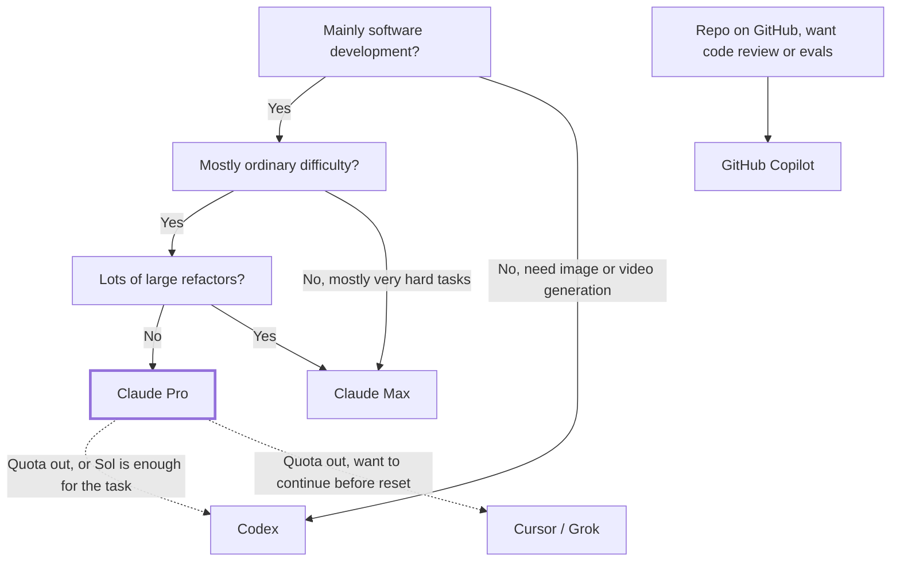

:::note[Token Value Maxxing series: a side story]
This post isn't about saving tokens but about how much to pay for them. For saving tokens, see the [series overview](/en/blog/token-value-maxxing/).
:::

In Stephen Chow's *King of Comedy*, Cuckoo asks Wan Tin-sau what they'll do from here, and he answers: "**I'll take care of you.**"

After I subscribed to Max, Anthropic told me the same thing. Then I started working overtime.

---

## The Bill First: $5,355 in One Month

I am on Claude Max 5x ($100 a month), and my billing cycle ran from 8/27 to 9/27. Below is Claude usage on my two machines over the most recent 30 days, which roughly overlap that cycle, **priced at API list rates** (not what I paid; I paid only the subscription fee):

| Model | Machine A | Machine B | Total |
|---|---:|---:|---:|
| Claude Opus 5 | $2,959.75 | $684.50 | $3,644.25 |
| Claude Opus 5.5 | $130.29 | $593.70 | $723.99 |
| Claude Opus 4.7 | $243.43 | — | $243.43 |
| Claude Sonnet 5 | $446.40 | $254.78 | $701.18 |
| Claude Fable 5.1 | $38.80 | — | $38.80 |
| Claude Haiku 4.5 | $1.90 | $1.63 | $3.53 |
| **Total** | **$3,820.56** | **$1,534.61** | **$5,355.17** |

Three things stand out:

1. **The Opus family accounts for 86%.** It's the model I use most and like best.
2. **The most expensive model, Fable 5.1, is under 1%.** I barely had tasks that needed it.
3. **Opus 5.5 shipped on 9/22**, and in its one week it caught up with a full month of Sonnet 5.

---

## How Big Is the Subsidy: SemiAnalysis's Estimate

[SemiAnalysis](https://x.com/SemiAnalysis_/status/2064815044085318040) estimated what each subscription is worth at API list prices when fully used:

| Plan | Monthly fee | API equivalent at full use | Multiple |
|---|---:|---:|---:|
| Claude Pro | $20 | ~$400 | 20× |
| Claude Max 5x | $100 | ~$2,000 | 20× |
| Claude Max 20x | $200 | ~$8,000 | 40× |
| ChatGPT Plus | $20 | ~$700 | 35× |
| ChatGPT Pro 5x | $100 | ~$3,500 | 35× |
| ChatGPT Pro 20x | $200 | ~$14,000 | 70× |

They also assume API list prices carry a 75% gross margin, so the cost to serve is about 25% of list. Under that assumption, Claude Pro and Max 5x start losing money above 20% average utilization, and Max 20x above 10%.

By that math, serving me this month cost roughly $5,355 × 25% ≈ **$1,339**, and I paid $100. **I'm the one being subsidized.** That's also why leaving quota unused felt like a waste.

Still, $5,355 is 2.7 times their estimate for a fully used Max 5x (about $2,000). Part of that is the one-time quota reset that shipped with Opus 5.5, which I used; but I think the bigger reason is the cache: over 95% of the tokens on both machines were cache reads. Cache reads are cheap to serve, so a high-hit-rate workload may get far more list-price value per unit of quota than a typical estimate assumes. Anthropic hasn't published how subscription limits count cache reads, though, so this is my inference. For keeping the hit rate high, see [part 2](/en/blog/cache-session-habits/).

---

## Choosing a Provider

### Claude: Opus Is the Workhorse in the Middle

Per [Claude's official pricing](https://platform.claude.com/docs/en/about-claude/pricing), Opus 5.5, released on 9/22, is cheaper than Opus 5:

| Model | Input | Output | Cache read |
|---|---:|---:|---:|
| Claude Fable 5.1 | $10 | $50 | $0.25 |
| Claude Opus 5 | $5 | $25 | $0.50 |
| **Claude Opus 5.5** | **$4** | **$20** | **$0.20** |
| Claude Sonnet 5.5 | $2 | $10 | $0.20 |

(USD per million tokens)

Cache reads dropped from $0.50 to $0.20, the same as Sonnet 5.5. In coding-agent work, cache reads are usually the bulk: of machine A's 6.4B tokens over these 30 days, 6.2B were cache reads. In other words, **on the line item that dominates, Opus 5.5 costs the same as Sonnet 5.5**.

My observation: for typical in-house software development, Opus is enough. Reaching for the most expensive model is like firing a cannon at a sparrow; unless the task is genuinely hard, I don't recommend it as the default. For which task gets which model, see [part 3](/en/blog/subagent-model-selection/).

Since Sonnet 5.5 shipped, I switch by task: Sonnet 5.5 for well-scoped work whose result can be checked automatically (small projects, single-point edits, documents); Opus 5.5 stays the default for cross-module refactors, legacy-framework upgrades, and large projects with thin test coverage. On effort, both default to `medium` in Claude Code; Sonnet 5.5's levels are recalibrated, so don't carry over Sonnet 5 settings.

### Codex: More Quota, and Sol May Now Cover the Middle

Codex looks like it gives more quota, and its limits reset often. The question is whether its model ladder has enough rungs:

| Role | Claude | OpenAI |
|---|---|---|
| Strongest | Fable 5.1 ($10 / $50) | GPT-6 Astra ($10 / $50) |
| Middle | Opus 5.5 ($4 / $20) | GPT-6.1 Sol ($2 / $10) |
| Workhorse | Sonnet 5.5 ($2 / $10) | GPT-6.1 Sol ($2 / $10) |

Per [OpenAI's official pricing](https://developers.openai.com/api/docs/pricing), the GPT-6 family has only Astra, Sol, and Luna; there is no Terra. GPT-6.1 Sol (which replaced GPT-6 Sol a week after its launch) is priced the same as Sonnet 5.5, with cached input at $0.10, even cheaper than the previous GPT-5.6 Terra.

Before I canceled Codex, I was using GPT-5.6 Sol, and it felt roughly Sonnet-level. Looking at third-party evaluations instead, Artificial Analysis gives these Intelligence Index scores (all at maximum effort; see the [Opus 5.5](https://artificialanalysis.ai/models/releases/comparisons/gpt-6-1-sol-vs-claude-opus-5-5) and [Sonnet 5.5](https://artificialanalysis.ai/models/releases/comparisons/gpt-6-1-sol-vs-claude-sonnet-5-5) comparisons):

| Model | Intelligence Index | Cost per task |
|---|---|---|
| Claude Opus 5.5 | 58 | $5.98 |
| Claude Sonnet 5.5 | 56 | $7.60 |
| GPT-6 Astra | 53 | $3.26 |
| GPT-6.1 Sol | 52 | $0.72 |

GPT-6.1 Sol costs the same per token as Sonnet 5.5 and trails it by only 4 points, and Opus 5.5 by 6, while costing far less per task. The next rung up is Astra, which costs as much as Fable and scores just 1 point higher, so Sol is the sensible stop. **Before 6.1, Codex lacked an Opus: strong enough, and not too expensive. Now Sol looks like it could be both the middle rung and the workhorse.** Two caveats. First, cost per task is not completion rate: Sonnet 5.5 generated about 6 times Sol's output tokens on the same index, and that accounts for most of the cost gap. Second, on Terminal-Bench 4.0, the closest test to Codex-style work, Artificial Analysis shows 6.1 Sol gaining 12 points over GPT-6 Sol (about 56% by my arithmetic; the article gives only the gain), still behind Sonnet 5.5 (63.6%) and Opus 5.5 (59.6%). It shipped only a day ago and I haven't used it enough, so I'd keep cross-module refactors on Opus for now.

So I'd consider Codex for everyday development with Sol as the default model and Luna for the simplest tasks, once you've confirmed Sol handles your own tasks; it also fits when your work needs image or video generation.

### GitHub Copilot: For Review and Evals

Per [GitHub's plans page](https://github.com/features/copilot/plans), each Copilot plan's fee comes with an equal amount of AI credits plus a small flex allowance:

| Plan | Monthly fee | Usable allowance | Multiple |
|---|---:|---:|---:|
| Copilot Pro | $10 | $15 | 1.5× |
| Copilot Pro+ | $39 | $70 | 1.8× |
| Copilot Max | $100 | $200 | 2× |

For the same Sonnet 5.5, Claude Pro subsidizes about 20×, Copilot under 2×: **more than a tenfold gap**. The allowance also resets only once a month.

I can think of only two reasons to use it:

- Your repo lives on GitHub and you want Copilot code review.
- Like me, you use it to run [evals for Agent Skills](https://github.com/akunzai/agent-skills).

Beyond that, Copilot doesn't pay off as your primary coding agent.

### Cursor / Grok: The Spare When Claude Runs Out

I still subscribe to Cursor, mainly with Grok models, and it performs well (machine B used about $147 on Cursor this month, mostly `grok-4.6-high`); I also had SuperGrok before, since canceled. But like Copilot, both allowances are monthly; there's no 5-hour and 7-day reset cycle subsidizing you as with Claude and Codex. Heavy development burns through it fast.

My use: **when my Claude quota runs out and I want to keep going before the reset, I switch to Cursor.**

---

## Decision Flow

---

## Why I'm Dropping Back to Pro

To be honest, per [Claude's plans page](https://claude.com/pricing), Max 5x gives 5 times Pro's usage per session. With the same habits, Pro would last about a fifth of this month. Neither the Opus 5.5 price cut nor the 20% higher 5-hour limit closes that gap.

What I want to test is something else: **how much of that 5× did I use only because the quota was there?**

On Max, I often looked at the remaining quota late in the evening, felt it would be a waste to leave it, and kicked off another task. The result wasn't better work, just more tiring overtime. That is Token Maxxing: treating token volume as the goal.

My recommendations:

- **For typical in-house software development, start with Claude Pro**, paired with the habits from the [Token Value Maxxing series](/en/blog/token-value-maxxing/): keep resident context lean, don't let the cache expire, put model choice at the moment of decision, and prevent rework at the source.
- **Consider Max only for long, token-heavy work** such as large refactors.
- **When the 5-hour or 7-day quota runs out, take a break.** The reset cycle doesn't just limit you; it reminds you to stop.

Claude Sonnet 5.5 shipped on 9/28: still $2 / $10, but its Intelligence Index jumped from Sonnet 5's 38 to 56, close to Opus 5.5 and ahead of GPT-6.1 Sol at the same price; Anthropic says Haiku 5.5 will follow in the coming weeks. Work handed to subagents gets cheaper, and the Pro quota goes further.

I'll run Pro for a full month next month and report back.

Stop chasing Token Maxxing. Get the most value out of every token instead.

---

## References

- [SemiAnalysis: Subscription margin by utilization](https://x.com/SemiAnalysis_/status/2064815044085318040) — API-equivalent value and margin estimates for each subscription at full use
- [Claude Platform: Pricing](https://platform.claude.com/docs/en/about-claude/pricing) — API list prices for Claude models
- [Claude: Plans & Pricing](https://claude.com/pricing) — Pro / Max plans and the 5-hour and weekly usage limits
- [Claude announcement: higher 5-hour limits on Pro, Max, and Team](https://x.com/claudeai/status/2102435538120691886) — quota changes that shipped with Opus 5.5
- [OpenAI API: Pricing](https://developers.openai.com/api/docs/pricing) — API list prices for GPT-6 Astra / Sol / Luna
- [Artificial Analysis: Claude Opus 5.5 vs GPT-6.1 Sol](https://artificialanalysis.ai/models/releases/comparisons/gpt-6-1-sol-vs-claude-opus-5-5) — third-party Intelligence Index scores and cost per task
- [Claude Sonnet 5.5 announcement](https://www.anthropic.com/claude-sonnet-5-5) — release date, pricing, and the Haiku 5.5 timeline
- [Artificial Analysis: GPT-6.1 Sol vs Claude Sonnet 5.5](https://artificialanalysis.ai/models/releases/comparisons/gpt-6-1-sol-vs-claude-sonnet-5-5) — third-party comparison of the two models at the same price
- [GitHub Copilot: Plans](https://github.com/features/copilot/plans) — Copilot plan fees and AI credits
- [Cursor: Pricing](https://cursor.com/pricing) — Cursor plans
- [akunzai/agent-skills](https://github.com/akunzai/agent-skills) — the skills repository whose evals run on Copilot
