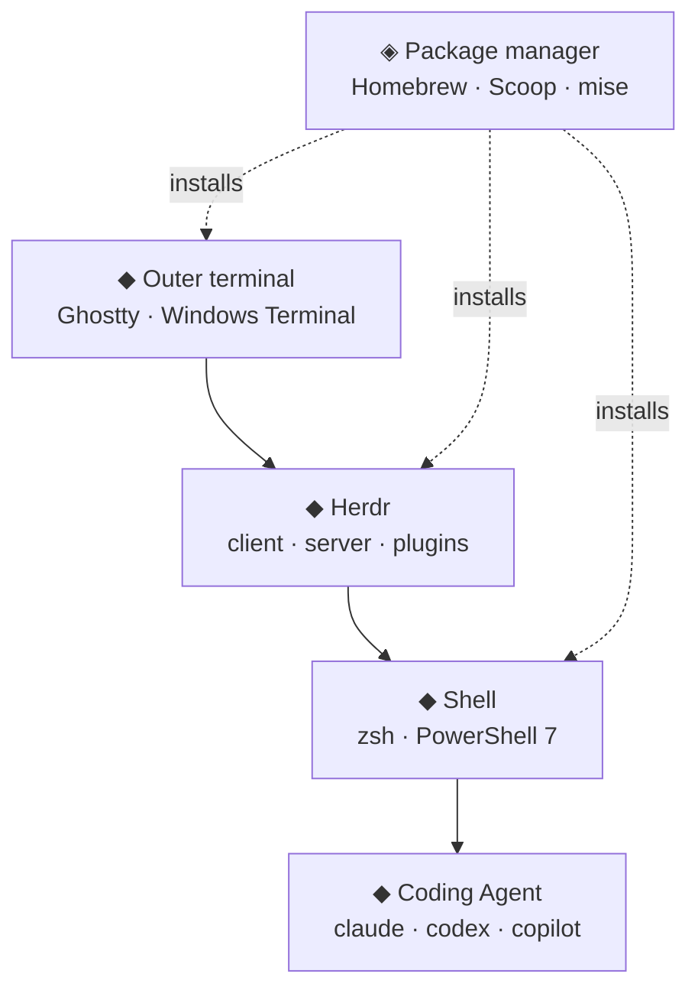

Herdr is a terminal multiplexer built for Coding Agents. Every Agent (Claude Code, Codex, GitHub Copilot CLI, and others) lives in a real terminal pane. Herdr tracks whether each one is working, blocked, or done, and the whole Session survives closing your terminal window.

This note covers the part that is identical on every machine: the mental model, daily keys, configuration, and plugins. Platform setup is split out:

- [Herdr on macOS: Ghostty, Zsh, and Homebrew](../herdr-terminal-macos/)
- [Herdr on Windows: Windows Terminal, PowerShell 7, and Scoop](../herdr-terminal-windows/)

My real configuration lives in a few Gists that I keep changing, so these notes record **what matters and why**, and link to the Gist for the current details.

---

## Where Herdr Sits

**Herdr does not replace your terminal setup, it sits on top of it.** A weak font, a swallowed shortcut, or a shell that only works when you open it by hand shows up in every pane, multiplied by the number of Agents you run.



| Layer | Job | What goes wrong when neglected |
| :--- | :--- | :--- |
| Outer terminal | Fonts, key delivery, graphics | Broken glyphs, `;3D` garbage, swallowed shortcuts |
| Herdr | Panes, Agent state, Session persistence | Hard to read sidebar, no state restore |
| Shell | Environment, `PATH`, prompt | Agent cannot find tools you can |
| Package manager | Reproducible installs | Every machine drifts differently |

Most "Herdr is flaky" reports trace back to the layer below the one being blamed. The two platform notes cover those lower layers.

---

## Install

Install it with the package manager you already use, and pick **one** source per machine:

```bash
brew install herdr      # macOS (Homebrew)
scoop install herdr     # Windows (Scoop, main bucket)
mise use -g herdr       # any platform (mise)
```

There is also a direct installer for each platform on the [install page](https://herdr.dev/docs/install/). `herdr update` only applies to direct installs. Package-managed installs must be upgraded with that package manager, and a compatible running server keeps the old version while the updated client can reconnect. Restart only when you need server-side changes: `herdr server stop` terminates pane processes. Finish or save running work first.

On a managed device, first check which installation methods are available. Scoop and mise normally install under the Windows user profile. On macOS, your account must be able to write to the Homebrew prefix before installing ordinary formulae without elevation. In some enterprise environments, elevation may require a separate request; follow the local installation rules when an installer asks for administrator rights.

---

## The Mental Model

| Concept | Meaning | How I use it |
| :--- | :--- | :--- |
| Workspace | Top-level container for a project | One per repository or task |
| Tab | A layout inside a Workspace | Separate views: agents, logs, server, review |
| Pane | A real terminal | One Agent or one shell per Pane |
| Session | A persistent server namespace | The default one is enough; add named Sessions only for fully separate setups |
| Client / server | The server owns panes, the client is the UI | Detach the client and everything keeps running |

Each Agent reports one of these states in the sidebar:

| State | Meaning |
| :--- | :--- |
| `blocked` | Needs input, approval, or a decision |
| `working` | Actively running |
| `done` | Finished, and you have not looked yet |
| `idle` | Finished or waiting, and already seen |
| `unknown` | Agent detected, but state cannot be classified confidently |

Giving each project its own Workspace is what keeps this sidebar readable. Jump to whatever is `blocked` first.

---

## A First Session

```bash
cd ~/code/my-project
herdr            # starts or attaches to the background session
claude           # run an Agent in the pane; Herdr detects it
```

Close the terminal, or press `prefix+q` to detach. The server and every Agent keep running. Run `herdr` again to reattach. `herdr server stop` terminates the pane processes; the next launch restores the saved layout, rather than keeping those processes alive.

Herdr is mouse-native, so you can start by clicking and dragging. The keyboard layer is optional. The default prefix is `ctrl+b`: press it, release, then press an action key.

| Action | Key |
| :--- | :--- |
| New Tab | `prefix+c` |
| Split right / down | `prefix+v` / `prefix+minus` |
| Move between panes | `prefix+h/j/k/l` |
| Workspace navigation | `prefix+w` |
| Detach | `prefix+q` |
| Show every binding | `prefix+?` |

> [!TIP]
> `prefix+g` opens the Goto picker, which lists every Agent and terminal grouped by Workspace. Press `b` there to filter blocked Agents only.

### Working remotely

- **SSH, then Herdr**: `ssh you@server`, then `herdr`. It behaves like tmux on that machine, and also works from a phone SSH client.
- **`herdr --remote <host>`**: a local UI attached to the remote Session, including local clipboard image paste.
- **Saved machines**: `herdr machine add <host> --label <label>` keeps several machines in one window.

---

## Integrations

Herdr combines process detection, terminal output, and integration reports to recognize Agents and their state. To support resuming the *same* conversation after a server restart, install a current integration for each supported Agent:

```bash
herdr integration install claude
herdr integration install codex
herdr integration status
```

The [Agents page](https://herdr.dev/docs/agents/) lists every supported Agent and which ones report their own state. Windows supports a narrower set of integrations than macOS and Linux.

| What survives | Process keeps running | Layout returns | Agent conversation resumes |
| :--- | :---: | :---: | :---: |
| Detach and reattach | Yes | Yes | Yes |
| Server restart | No | Yes | With a valid native session reference and restore enabled |

Restore also requires a current integration that reports a valid session reference and `[session] resume_agents_on_restore = true` (the default). Installation alone is not a guarantee; unsupported or stale references return as ordinary shells. See [session restore](https://herdr.dev/docs/session-state/#native-agent-session-restore).

---

## Configuration Worth Keeping

My [Herdr Gist](https://gist.github.com/akunzai/5fca04af65c7ce705be190135191e8e9) is small. It is shared across platforms, and `config.toml` is the file that matters (on macOS it lives at `~/.config/herdr/config.toml`). These are the parts I would carry to a new machine:

| Setting | Why |
| :--- | :--- |
| `[theme] name = "catppuccin"` | Matches the prompt; consistent contrast in the sidebar |
| `[ui] status_indicators = "symbols"` | Agent state readable at a glance, no color needed |
| `[ui] show_agent_labels_on_pane_borders = true` | Know which Agent owns a pane when you zoom out |
| `[ui.sound] enabled = true` | Hear when an Agent finishes or blocks, then switch back |
| `[[keys.command]]` entries | Bind plugin actions to `prefix+...` keys |

Prefix-free chords are most reliable on `ctrl+alt`, which terminals and desktops leave almost untouched. Check the [keyboard guide](https://herdr.dev/docs/keyboard/) before binding anything else.

### Plugins

Plugins are installed per machine and recorded in `plugins.json`. That file contains absolute paths, so treat it as a reference and not something to copy.

| Plugin | Purpose | macOS | Windows |
| :--- | :--- | :---: | :---: |
| [herdr-sidebar](https://github.com/alexarthurs/herdr-sidebar) | File explorer and source control pane | ✓ | ✓ |
| [herdr-hunk-diff](https://github.com/jhochenbaum/herdr-hunk-diff) | Review Agent diffs, send comments back | ✓ | ✓ |
| [herdr-cache-hit](https://github.com/e-kotov/herdr-cache-hit) | Prompt-cache hit rate per Agent | ✓ | not listed |
| [terminal-browser](https://github.com/zenbu-labs/terminal-browser) | Browser inside a pane | ✓ | not listed |

The platform columns reflect each plugin's manifest. Herdr's Windows plugin support is still marked as preview, so expect gaps there.

---

## Herdr Skill for Agents

The [`herdr` skill](https://github.com/herdrdev/herdr/tree/main/skills/herdr) teaches an Agent how to drive Herdr itself. Once installed, an Agent running inside a pane can open and control other panes, tabs, and workspaces, which covers cases like these:

- Open a pane that runs `ssh` to a remote host, then send commands and read the output back.
- Run [terminal-browser](https://github.com/zenbu-labs/terminal-browser) in a split pane to operate a web page inside the terminal.
- Start another harness CLI (Claude Code, Codex, and so on) in a new pane, hand it a task, and watch its state.

Install it with the [Skills CLI](https://github.com/akunzai/skills-manager), which records it in `~/.agents/skills.json`:

```sh
skills add herdrdev/herdr --skill herdr
```

The skill instructs the Agent to check `HERDR_ENV=1` before controlling Herdr and to use it only when explicitly requested. Whether it is discovered or loaded depends on the harness and skill installation; the environment variable alone does not load it. For the browser use case, also install the terminal-browser skill alongside the plugin.

---

## On Using Gists as the Source of Truth

I considered embedding the Gists directly into these pages and decided not to:

- An embed loads third-party JavaScript that writes into the page at load time. It renders nothing without it, and it cannot be indexed by the site's search.
- Gists change; an embedded snapshot in an article is still a stale copy in a reader's head.
- A link plus the *reason* for each setting stays true longer than the setting itself.

So use the Gists as the latest implementation and these notes as the reasoning. Gists are personal configurations, not compatibility specifications. If they differ from these notes, check the official documentation for your installed version before copying a setting.

---

## References

- [Herdr: Quick start](https://herdr.dev/docs/quick-start/) — First session, mouse use, and basic keys
- [Herdr: Concepts](https://herdr.dev/docs/concepts/) — Workspace, tab, pane, Agent states, Session, and modes
- [Herdr: How to work with Herdr](https://herdr.dev/docs/how-to-work/) — Local, SSH, phone, and `--remote` workflows
- [Herdr: Session state and restore](https://herdr.dev/docs/session-state/) — What survives detach, restart, and update
- [Herdr: Install](https://herdr.dev/docs/install/) — Homebrew, mise, Nix, and direct installation, plus update behavior
- [Herdr: Keyboard](https://herdr.dev/docs/keyboard/) — Prefix model, default keymap, and safe prefix-free chords
- [Herdr: Agents and Integrations](https://herdr.dev/docs/agents/) — Supported Agents and `herdr integration install`
