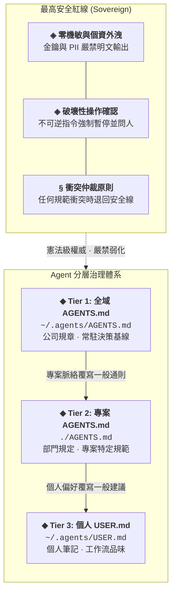

周星馳在《少林足球》裡有一句經典台詞：「**做人如果沒有夢想，跟鹹魚有什麼分別？**」

在人機協同開發的時代，未經架構調校的 AI Coding Agent，往往就像是一條條**隨時失憶的鹹魚**：
- **交接失憶**：剛剛在對話裡苦口婆心交代的架構約束，開個新 session 就忘得一乾二淨；換個 CLI 工具更得從零開始訓話。
- **不知輕重**：把含有正式環境金鑰或客戶 PII 個資的 log 毫不遮掩地貼在終端機裡，甚至逕自執行無法復原的破壞性指令。
- **重複踩坑**：上週才踩過的套件相容性地雷，這週換個 prompt 又踩了一次。
- **一本正經胡說八道**：用極其篤定的語氣捏造早已棄用的參數或不存在的 API。

與其每次重開對話就崩潰一次，不如把團隊規範與你的工程品味沉澱為系統化的「新人教戰手冊」。本文分享我實踐多時的 **全域 `AGENTS.md` 分層治理架構**，讓每條失憶的鹹魚都能從你的高度起跑。

---

## 架構演化：站在巨人肩膀上的脈絡工程

這套體系並非憑空捏造，而是在人機協同的大量實戰踩坑中，前後研讀並揉合了社群與官方的三篇關鍵文獻思維演化而來：

1. **社群實踐啟發：@Mnilax 的 [12 Rules for CLAUDE.md](https://x.com/mnilax/status/2053116311132155938)**  
   點出了「指令文件絕非垃圾桶」的關鍵盲點：規則必須精簡、不可自程式碼推導（Non-derivable），且應由誰會打破規範就留在哪裡的原則（Ownership）來決定存放層級，杜絕流水帳式的無效 Prompt。
2. **官方 Session 治理：Anthropic 的 [Maximizing the Value of Your Claude Code Sessions](https://claude.com/blog/maximizing-the-value-of-your-claude-code-sessions)**  
   深入探討了 Session 生命週期治理與 Context 污染的代價：重視保持主對話脈絡輕盈、任務階段性交付、善用重置與適時委派，避免一次性重工泥淖淹沒長效核心準則。
3. **前瞻脈絡工程：[The New Rules of Context Engineering](https://claude.com/blog/the-new-rules-of-context-engineering-for-claude-5-generation-models)**  
   確立了新一代前瞻模型的脈絡工程哲學——**漸進式揭露（Progressive Disclosure）與動態情境掛載**：與其在開場一股腦塞入三千行規則造成注意力稀釋（Attention Dilution），不如打造常駐骨幹並按需動態喚醒情境規則。

基於這些思維碰撞，我梳理出能跨工具、兼顧安全與極致脈絡效率的分層治理架構。

---

## 1. 核心設計哲學

要建構可長可久的 Agent 治理體系，必須在三大張力之間取得平衡：

> **安全底線絕不妥協（Safe） ✕ 脈絡空間極致精簡（Context-Efficient） ✕ 權屬分類清楚（Ownership）**

1. **單一真實來源（Single Source of Truth, SSOT）**：以本機 `~/.agents/AGENTS.md` 作為最高綱領，確保所有工具讀到同一份準則。
2. **符號連結（Symlink）跨工具統整**：不為每個 CLI 重複複製貼上配置。Copilot CLI 原生會讀取 `~/.agents/AGENTS.md`，其餘工具透過 symlink 跨接：
   ```bash
   mkdir -p ~/.claude ~/.codex ~/.gemini
   ln -s ~/.agents/AGENTS.md ~/.claude/CLAUDE.md
   ln -s ~/.agents/AGENTS.md ~/.codex/AGENTS.md
   ln -s ~/.agents/AGENTS.md ~/.gemini/GEMINI.md
   ```
3. **保持純淨語法**：全域手冊嚴禁使用特定廠商私有的標籤或語法糖，確保跨模型、跨工具解析的一致性。

---

## 2. 三層覆寫關係與衝突裁決

就像健全的現代企業組織，規範必須層級分明，但遇衝突時必須有清晰的仲裁原則：



### 衝突裁決原則（Precedence）
- **專案規定** 優先於全域手冊的一般通則。
- **個人偏好**（`USER.md`）可覆寫其他一般建議。
- **絕對紅線**：任何專案規範或個人偏好，**絕對不可弱化最高安全規範（Security Rules）**。當規定衝突時，Agent 必須**強制退回安全紅線並向人類求證**，嚴禁擅自兩邊各打五十大板。

---

## 3. 最高安全紅線：其實，我是一個警察

在電影《喜劇之王》中，主角常說「其實，我是一個演員」；而在 Agent 系統中，「其實，我是一個警察」才是關鍵時刻保全系統身家性命的定海神針。

- **零機敏外洩（Zero Secret / PII Leaks）**：嚴禁以明文形式輸出、轉傳或記錄真實的金鑰（Tokens, Passwords）與客戶個資（PII）。
  - *個資門檻*：遮罩後仍具備業務分析價值（例如稱呼「客戶王先生」），只要無法被逆向識別，Agent 即可自主推進。
  - *金鑰門檻*：遮罩後僅剩識別功能（例如「結尾為 `XY27` 的那把金鑰」），若需讀取真值，**必須取得人類明確授權**。
- **破壞性操作確認**：舉凡 `git reset --hard`、批次刪除或資料庫抹除等不可逆操作，一律強制停下並等待人類確認。

---

## 4. 常駐框架 vs. 按需情境規則（Topic-Scoped Rules）

許多團隊在導入 Agent 時，習慣把厚達三千行的守則一股腦塞進 Prompt，結果把珍貴的 Context Window 吃得一乾二淨，AI 反而因「注意力潰散」而開始胡說八道。

我們的解法是**精簡常駐框架，按需動態掛載**：

- **常駐核心（`~/.agents/AGENTS.md`）**：僅保留極簡原則——Precedence、安全底線、記憶持久化規範（明確指示才寫入）、時效性外部查證（杜絕憑記憶猜測過期版本號）。
- **情境錦囊（`~/.agents/rules/*.md`）**：平時絕不進 Context，唯有觸發特定情境條件時才由 Agent 動態載入：
  - `sensitive-data.md`：觸及金鑰或敏感資料來源時觸發。
  - `coding.md`：動手撰寫程式碼時觸發，定義衝突裁決順序（安全與正確性 → 專案既有風格 → 簡潔度 → 個人品味）。
  - `subagents.md`：遇到龐大且繁重的探索任務時觸發，**將髒活委派給子代理人**，在低成本模型中燃燒過程，主線僅接收精煉結論。
  - `skills.md` 與 `contact.md`：指引技能安裝與非對話時段的緊急聯繫機制。

---

## 結語

面對日新月異的 AI 工具鏈，最強大的競爭力不是記得幾句魔法 Prompt，而是為你的數位助手建立一套具備主權、彈性與安全邊界的架構。

**與其每次重開對話都重教一次，不如把你的品味與規矩寫下來。讓每一條失憶的鹹魚，都能從你的高度開始。**

---

## 參考資料

- [My Global Agent Instructions (GitHub Gist)](https://gist.github.com/akunzai/c6c90c01a07eba50d26514ce676eaa40) — 全域 `AGENTS.md`、`rules/` 與 `USER.md` 開源實作範本
- [GitHub 專案：akunzai/agent-skills](https://github.com/akunzai/agent-skills) — 精選工程規範 Agent 技能庫
- [GitHub 專案：akunzai/skills-manager](https://akunzai.github.io/skills-manager/) — 跨平台 Agent 技能宣告式管理工具
- [12 Rules for CLAUDE.md by @Mnilax](https://x.com/mnilax/status/2053116311132155938) — 社群啟發性的 CLAUDE.md 設計思考
- [Anthropic: Maximizing the Value of Your Claude Code Sessions](https://claude.com/blog/maximizing-the-value-of-your-claude-code-sessions) — 官方關於 context 與 session 治理的最佳實踐
- [Anthropic: The New Rules of Context Engineering](https://claude.com/blog/the-new-rules-of-context-engineering-for-claude-5-generation-models) — 前瞻模型情境工程與注意力治理的核心準則
