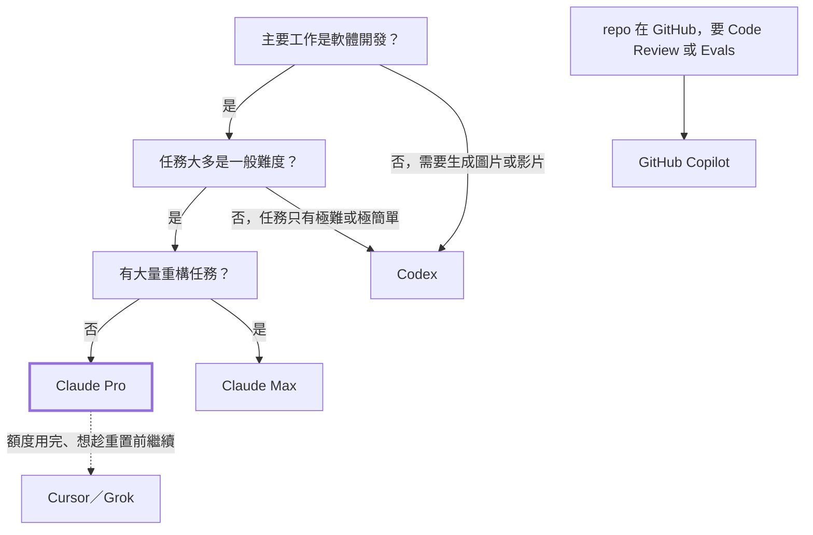

:::note[Token Value Maxxing 系列番外篇]
這篇不談怎麼省 token，而是談「該付多少錢買 token」。省 token 的方法請看[系列總綱](/zh-tw/blog/token-value-maxxing/)。
:::

《喜劇之王》裡，柳飄飄問尹天仇以後怎麼辦，尹天仇說：「**我養你啊。**」

訂了 Max 之後，Anthropic 也對我說了一樣的話。然後我就開始加班了。

---

## 先看帳：一個月 5,355 美元

我訂的是 Claude Max 5x（每月 $100），訂閱週期是 8/27 到 9/27。下面是兩台主機在大致重疊的最近 30 天內的 Claude 用量。金額都**以 API 牌價換算**，不是實際付的錢；實際只付了訂閱費：

| 模型 | 主機 A | 主機 B | 合計 |
|---|---:|---:|---:|
| Claude Opus 5 | $2,959.75 | $684.50 | $3,644.25 |
| Claude Opus 5.5 | $130.29 | $593.70 | $723.99 |
| Claude Opus 4.7 | $243.43 | — | $243.43 |
| Claude Sonnet 5 | $446.40 | $254.78 | $701.18 |
| Claude Fable 5.1 | $38.80 | — | $38.80 |
| Claude Haiku 4.5 | $1.90 | $1.63 | $3.53 |
| **合計** | **$3,820.56** | **$1,534.61** | **$5,355.17** |

三件事一眼就看得出來：

1. **Opus 系列佔了 86%。** 這是我最常用、也最愛用的模型。
2. **最貴的 Fable 5.1 不到 1%。** 我幾乎沒有需要它的任務。
3. **Opus 5.5 在 9/22 才釋出**，只用了最後一週，就追上 Sonnet 5 整個月的量。

---

## 補貼有多大：SemiAnalysis 的估算

[SemiAnalysis](https://x.com/SemiAnalysis_/status/2064815044085318040) 估算了各家訂閱方案「用滿」時，換算成 API 牌價大約值多少錢：

| 方案 | 月費 | 用滿時的 API 等值 | 倍數 |
|---|---:|---:|---:|
| Claude Pro | $20 | ~$400 | 20× |
| Claude Max 5x | $100 | ~$2,000 | 20× |
| Claude Max 20x | $200 | ~$8,000 | 40× |
| ChatGPT Plus | $20 | ~$700 | 35× |
| ChatGPT Pro 5x | $100 | ~$3,500 | 35× |
| ChatGPT Pro 20x | $200 | ~$14,000 | 70× |

他們同時假設 API 牌價有 75% 毛利，也就是實際服務成本約為牌價的 25%。在這個假設下，Claude Pro 與 Max 5x 平均使用率超過 20% 就開始虧錢；Max 20x 超過 10% 就開始虧。

照這個估算，我這個月的服務成本大約是 $5,355 × 25% ≈ **$1,339**，而我付了 $100。**我是被補貼的那一方。**這也是為什麼我會覺得「不用光很可惜」。

不過，$5,355 已經是他們估算的 Max 5x 用滿值（約 $2,000）的 2.7 倍。一部分是因為 Opus 5.5 釋出時送的那次額度重置，我用掉了；但我認為更大的原因是 cache：兩台主機的 token 有 95% 以上是 cache 讀取。Cache 讀取對服務方來說本來就便宜，高命中率的用法，每單位額度換到的牌價金額，可能遠高於一般估算。不過 Anthropic 並未公開訂閱額度如何計算 cache 讀取，這只是我的推論。怎麼維持高命中率，請見[第 2 篇](/zh-tw/blog/cache-session-habits/)。

---

## 各家怎麼選

### Claude：Opus 就是那個中堅份子

依 [Claude 官方定價](https://platform.claude.com/docs/en/about-claude/pricing)，9/22 釋出的 Opus 5.5 比 Opus 5 更便宜：

| 模型 | Input | Output | Cache 讀取 |
|---|---:|---:|---:|
| Claude Fable 5.1 | $10 | $50 | $0.25 |
| Claude Opus 5 | $5 | $25 | $0.50 |
| **Claude Opus 5.5** | **$4** | **$20** | **$0.20** |
| Claude Sonnet 5.5 | $2 | $10 | $0.20 |

（單位：美元／百萬 token）

Cache 讀取從 $0.50 降到 $0.20，和 Sonnet 5.5 一樣。在 Coding Agent 的工作裡，cache 讀取往往就是大宗：主機 A 這 30 天的 6.4B token 裡，有 6.2B 是 cache 讀取。也就是說，**佔最大宗的那一項，Opus 5.5 和 Sonnet 5.5 同價**。

我的觀察是：一般企業內的軟體開發，Opus 就夠用了。最貴的模型像是拿大砲打小鳥，除非任務真的非常困難，否則不建議預設使用。什麼任務該用哪個模型，請見[第 3 篇](/zh-tw/blog/subagent-model-selection/)。

### Codex：額度多，但缺少中間那一階

Codex 的額度看起來更多，limit 也常常重置。但我自己用下來，覺得問題在模型階梯：

| 定位 | Claude | OpenAI |
|---|---|---|
| 最強 | Fable 5.1（$10／$50） | GPT-6 Astra（$10／$50） |
| 中堅 | Opus 5.5（$4／$20） | — |
| 主力 | Sonnet 5.5（$2／$10） | GPT-6 Sol（$2／$10） |

依 [OpenAI 官方定價](https://developers.openai.com/api/docs/pricing)，GPT-6 系列只有 Astra、Sol、Luna 三個型號，沒有 Terra。GPT-6 Sol 和 Sonnet 5.5 同價，甚至比上一代的 GPT-5.6 Terra 還便宜。

我退訂 Codex 前用的是 GPT-5.6 Sol，體感大約是 Sonnet 等級。改看第三方評測，Artificial Analysis 的 Intelligence Index（皆為最高 effort，見 [Opus 5.5](https://artificialanalysis.ai/models/releases/comparisons/gpt-6-sol-vs-claude-opus-5-5) 與 [Sonnet 5.5](https://artificialanalysis.ai/models/releases/comparisons/gpt-6-sol-vs-claude-sonnet-5-5) 的比較）是 Opus 5.5 58、Sonnet 5.5 56、GPT-6 Sol 48。GPT-6 Sol 和 Sonnet 5.5 同價，卻落後 8 分，和 Opus 5.5 更差了 10 分；再往上一階，就是和 Fable 一樣貴的 Astra。**Codex 缺的，仍是 Opus 這樣夠強、又不算貴的中堅份子。**

所以我會推薦 Codex 的情境是：你的任務不是更難（交給 Astra），就是更簡單（交給 Sol）；或是你的工作需要生成圖片或影片。

### GitHub Copilot：為了 Review 與 Evals

依 [GitHub 官方方案頁](https://github.com/features/copilot/plans)，Copilot 的月費包含一筆等值的 AI credits，外加一小筆 flex allowance：

| 方案 | 月費 | 可用額度 | 倍數 |
|---|---:|---:|---:|
| Copilot Pro | $10 | $15 | 1.5× |
| Copilot Pro+ | $39 | $70 | 1.8× |
| Copilot Max | $100 | $200 | 2× |

同樣是用 Sonnet 5.5，Claude Pro 的補貼大約是 20 倍，Copilot 不到 2 倍，**差了十倍以上**。額度也是每月重置一次。

我能想到的理由只有兩個：

- 你的 repo 在 GitHub 上，想用 Copilot Code Review。
- 像我一樣，用它跑 [Agent Skills 的 Evals](https://github.com/akunzai/agent-skills)。

除此之外，拿 Copilot 當主力 Coding Agent 並不划算。

### Cursor／Grok：Claude 用完時的備胎

我目前仍訂閱 Cursor，主要搭配 Grok 模型，表現不錯（主機 B 這個月在 Cursor 上用了約 $147，大多是 `grok-4.6-high`）；先前也訂過 SuperGrok，已經取消。但兩者都和 Copilot 一樣是以月為單位的額度，不像 Claude／Codex 有 5 小時與 7 天的重置週期在補貼。大量開發的話，很快就會用光。

我的用法是：**Claude 的額度用完、又想在重置前繼續時，才切到 Cursor。**

---

## 選擇流程

---

## 為什麼我要降回 Pro

誠實地說，依 [Claude 官方方案頁](https://claude.com/pricing)，Max 5x 每個 session 的用量是 Pro 的 5 倍。同樣的用法換成 Pro，大概只撐得住這個月的五分之一，Opus 5.5 降價和 5 小時上限提高 20% 都補不齊這個差距。

但我想驗證的是另一件事：**這 5 倍裡，有多少是因為「額度就在那裡」才用的？**

訂了 Max 之後，我常常在晚上看著剩下的額度，覺得不用光很可惜，於是又開了一個任務。結果不是工作做得更好，而是加班加得更累。這其實就是 Token Maxxing：把「用了多少 token」當成目標。

我的建議是：

- **一般企業內的軟體開發，先從 Claude Pro 開始**，搭配 [Token Value Maxxing 系列](/zh-tw/blog/token-value-maxxing/)的習慣：精簡常駐 context、別讓 cache 過期、把模型選擇放在做決定的那一刻、從根源避免重工。
- **只有大量重構這類長時間、高 token 的任務**，才考慮 Max。
- **5 小時或 7 天的額度用完，就休息吧。** 那個重置週期不只是在限制你，也是在提醒你該停下來了。

Claude Sonnet 5.5 已在 9/28 釋出：價格維持 $2／$10，Intelligence Index 卻從 Sonnet 5 的 38 跳到 56，直逼 Opus 5.5，也在同價位反超 GPT-6 Sol；Haiku 5.5 官方說會在幾週內跟上。交給 subagent 的工作會更便宜，Pro 的額度也更撐得住。

我會在下個月實際用 Pro 跑一整個月，再回來報告結果。

別再追求 Token Maxxing 了，把每一顆 token 的價值發揮到最大吧。

---

## 參考資料

- [SemiAnalysis：Subscription margin by utilization](https://x.com/SemiAnalysis_/status/2064815044085318040) — 各家訂閱方案用滿時的 API 等值與毛利估算
- [Claude Platform：Pricing](https://platform.claude.com/docs/en/about-claude/pricing) — Claude 各模型的 API 牌價
- [Claude：Plans & Pricing](https://claude.com/pricing) — Pro／Max 方案與 5 小時、每週的使用上限
- [Claude 官方公告：提高 Pro、Max、Team 的 5 小時使用上限](https://x.com/claudeai/status/2102435538120691886) — Opus 5.5 釋出時的額度調整
- [OpenAI API：Pricing](https://developers.openai.com/api/docs/pricing) — GPT-6 Astra／Sol／Luna 的 API 牌價
- [Artificial Analysis：Claude Opus 5.5 vs GPT-6 Sol](https://artificialanalysis.ai/models/releases/comparisons/gpt-6-sol-vs-claude-opus-5-5) — 第三方評測的 Intelligence Index 與每任務成本
- [Claude Sonnet 5.5 官方公告](https://www.anthropic.com/claude-sonnet-5-5) — 釋出日期、定價與 Haiku 5.5 的時程
- [Artificial Analysis：GPT-6 Sol vs Claude Sonnet 5.5](https://artificialanalysis.ai/models/releases/comparisons/gpt-6-sol-vs-claude-sonnet-5-5) — 同價位兩個模型的第三方比較
- [GitHub Copilot：Plans](https://github.com/features/copilot/plans) — Copilot 各方案的月費與 AI credits
- [Cursor：Pricing](https://cursor.com/pricing) — Cursor 方案
- [akunzai/agent-skills](https://github.com/akunzai/agent-skills) — 用 Copilot 跑 Evals 的 skills 儲存庫
