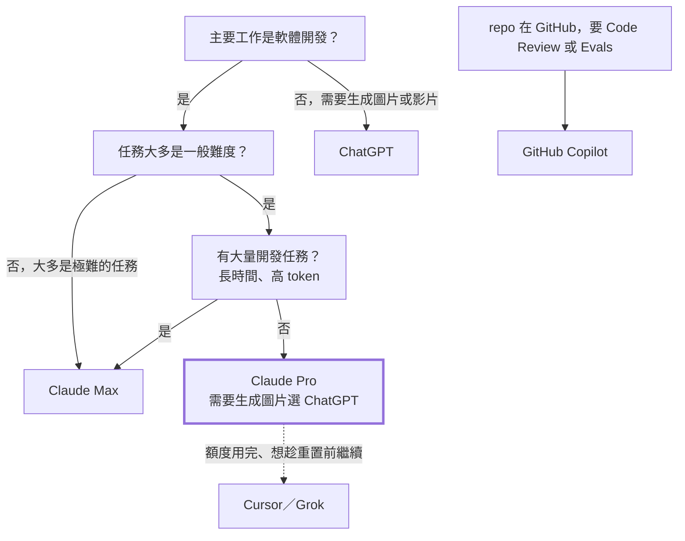

:::note[Token Value Maxxing 系列番外篇]
這篇不談怎麼省 token，而是談「該付多少錢買 token」。省 token 的方法請看[系列總綱](/zh-tw/blog/token-value-maxxing/)。
:::

《喜劇之王》裡，柳飄飄問尹天仇以後怎麼辦，尹天仇說：「**我養你啊。**」

訂了 Max 之後，Anthropic 也對我說了一樣的話。然後我就開始加班了。

---

## 先看帳：一個月 5,355 美元

我訂的是 Claude Max 5x（每月 $100），訂閱週期是 8/27 到 9/27。下面是兩台主機在大致重疊的最近 30 天內的 Claude 用量。金額都**以 API 牌價換算**，不是實際付的錢；實際只付了訂閱費：

| 模型 | 主機 A | 主機 B | 合計 |
|---|---:|---:|---:|
| Claude Opus 5 | $2,959.75 | $684.50 | $3,644.25 |
| Claude Opus 5.5 | $130.29 | $593.70 | $723.99 |
| Claude Opus 4.7 | $243.43 | — | $243.43 |
| Claude Sonnet 5 | $446.40 | $254.78 | $701.18 |
| Claude Fable 5.1 | $38.80 | — | $38.80 |
| Claude Haiku 4.5 | $1.90 | $1.63 | $3.53 |
| **合計** | **$3,820.56** | **$1,534.61** | **$5,355.17** |

三件事一眼就看得出來：

1. **Opus 系列佔了 86%。** 這是我最常用、也最愛用的模型。
2. **最貴的 Fable 5.1 不到 1%。** 我幾乎沒有需要它的任務。
3. **Opus 5.5 在 9/22 才釋出**，只用了最後一週，就追上 Sonnet 5 整個月的量。

---

## 補貼有多大：SemiAnalysis 的實測

[SemiAnalysis 在 10/5 發表的報告](https://newsletter.semianalysis.com/p/anthropic-subscriptions-offer-5x)逐一實測了各家訂閱方案「用滿」時，換算成 API 牌價大約值多少錢。下表是中堅模型（Claude 用 Opus 5.5、ChatGPT 用 GPT-6.1 Sol）在 agentic 工作負載下的結果，這組負載有 96.6% 是 cache 讀取：

| 方案 | 月費 | 每月可用 token | 用滿時的 API 等值 | 倍數 |
|---|---:|---:|---:|---:|
| Claude Pro | $20 | 2.9B | ~$1,178 | 59× |
| Claude Max 5x | $100 | 14.0B | ~$5,725 | 57× |
| ChatGPT Plus | $20 | 1.0B | ~$211 | 11× |
| ChatGPT Pro 100 | $100 | 5.1B | ~$1,055 | 11× |

倍數是「用滿時的 API 等值 ÷ 月費」，代表這個方案最多能換到多少 API 價值，前提是每週額度都用完、只用表中的模型。實際換到的價值，要再乘上你自己的使用率。

token 數包含輸入、cache 讀取、cache 寫入與輸出，負載比例依序為 0.4%、96.6%、2.6%、0.3%。換算下來，Claude 每塊錢約 140M token，ChatGPT 約 51M；$200 方案也一樣，Max 20x 為 28.6B，ChatGPT Pro 200 為 10.2B。

API 等值是「用得到的 token 數 × API 牌價」，所以會隨模型牌價變動：OpenAI 推出 GPT-6.1 Sol 時調降了 cache 讀取的價格，卻沒有增加 Sol 的 token 額度，API 等值因此掉了約 30%。不同時間、不同模型的金額不能直接比較；token 數不受牌價影響，比較適合拿來對照自己的用量。

同樣的月費，Claude 的 API 等值約是 ChatGPT 的 5 倍以上。OpenAI 在 9/29 把 $200 方案的額度砍半後，各方案每塊錢的價值已和 $100 方案一致；Anthropic 各方案本來就一致。ChatGPT 唯一的優勢是 Pro 方案沒有 5 小時上限，比較容易用滿整個月。另外，Fable 5.1 最多只能用掉 Claude 方案額度的 50%。

報告假設 API 牌價有 92% 毛利，也就是實際服務成本約為牌價的 8%。在這個假設下，只用 Opus 5.5 把額度用滿，毛利約為 −369%；平均使用率 20% 時約為 6%。

照這個假設，我這個月的服務成本大約是 $5,355 × 8% ≈ **$428**，而我付了 $100。**我是被補貼的那一方。**這也是為什麼我會覺得「不用光很可惜」。

以金額計算，$5,355 約是 Max 5x 用滿值的 94%；但其中大半是牌價較高的 Opus 5，以 token 計算比較準。我兩台主機合計約 10.2B token（主機 A 6.4B、主機 B 3.8B），約是 Max 5x 用滿值的 73%，其中還包含 Opus 5.5 釋出時送的那次額度重置。不同模型消耗額度的速度不同，兩個比例都只是估計，但結論一樣：我這個月用掉了大部分額度。我兩台主機的 token 有 95% 以上是 cache 讀取，和報告假設的工作負載相近，所以這個對照大致成立。怎麼維持高命中率，請見[第 2 篇](/zh-tw/blog/cache-session-habits/)。

報告也提醒，供應商隨時可以悄悄調整額度：他們測到同一方案的三個帳號中，有一個額度少了約 20%，事後確認是供應商的 A/B 測試。

---

## 先比較模型：`medium` 下的能力與成本

API 單價之外，我也想知道模型實際做任務的能力與花費。這裡統一採用 Artificial Analysis Intelligence Index v4.3.2 的 **`medium` effort**，對應 Claude Code 中 Opus 5.5 與 Sonnet 5.5 的預設設定，避免拿最高 effort 的成績與成本推論日常用法。以下資料查核於 2026-09-30；加入舊版 Sonnet 5、GPT-5.6 Sol 與 GPT-6 Sol 作為世代比較。各模型的評測資料可見 [Opus 5.5](https://artificialanalysis.ai/models/releases/claude-opus-5-5)、[Sonnet 5](https://artificialanalysis.ai/models/releases/claude-sonnet-5)、[Sonnet 5.5](https://artificialanalysis.ai/models/releases/claude-sonnet-5-5)、[GPT-5.6 Sol](https://artificialanalysis.ai/models/releases/gpt-5-6-sol)、[GPT-6 Sol](https://artificialanalysis.ai/models/releases/gpt-6-sol)、[GPT-6 Astra](https://artificialanalysis.ai/models/releases/gpt-6-astra) 與 [GPT-6.1 Sol](https://artificialanalysis.ai/models/releases/gpt-6-1-sol) 的評測頁：

| 模型（皆為 `medium`） | Intelligence Index | 每任務成本 |
|---|---:|---:|
| Claude Opus 5 | 45 | $2.19 |
| Claude Opus 5.5 | 51 | $1.34 |
| Claude Sonnet 5 | 28 | $1.00 |
| Claude Sonnet 5.5 | 41 | $0.59 |
| GPT-6 Astra | 50 | $1.54 |
| GPT-5.6 Sol | 39 | $0.50 |
| GPT-6 Sol | 40 | $0.25 |
| GPT-6.1 Sol | 48 | $0.21 |

先看世代變化：Sonnet 5.5 比 Sonnet 5 高 13 分，每任務成本低 41%；GPT-6.1 Sol 比 GPT-6 Sol 高 8 分，成本低 16%。若從我退訂前用過的 GPT-5.6 Sol 看起，GPT-6 Sol 只高 1 分，但成本減半；GPT-6.1 Sol 則高 9 分，成本低 58%。同名的 `medium` 設定下，新版都更強、也更省，但這不代表 effort 的運算預算相同。

在 `medium` 下，GPT-6.1 Sol 比 Sonnet 5.5 高 7 分，每任務成本低約 64%；和 Opus 5.5 差 3 分，成本則低約 84%。再往上一階的 Astra 比 Sol 高 2 分，成本卻約為 7.3 倍；Opus 還比 Astra 高 1 分、成本低約 13%。**以這組評測來看，Sol 有機會同時當 Codex 的中堅與主力；需要更高能力時，Opus 仍有優勢。** 同樣在 `medium` 下，Sonnet 比 Opus 便宜約 56%，但落後 10 分，也支持我把 Sonnet 用在範圍明確的工作，把複雜任務交給 Opus。

這裡仍有兩個保留。第一，各家對 `medium` effort 等級的定義不同，不代表相同的運算預算；Opus 5.5 與 Sonnet 5.5 的評測資料也包含預設 fallback，Sonnet 5 則標示為 Adaptive Reasoning、Medium Effort。第二，每任務成本是各評測的輸入、快取讀寫、推理與回答 token 費用，依任務數與指數權重計算的加權平均，不是成功完成一個任務的成本，也不能直接換算成訂閱額度。整體指數也不能代替你自己的開發任務，SemiAnalysis 也明言他們不認為這組評測任務能代表實際工作；Sol 才發布一天，我還沒用夠，所以跨模組重構我暫時仍交給 Opus。

除了分數與每任務成本，我還會看完成同一項工作要等多久，以及需要重做幾次。便宜的模型如果經常需要修改或重試，未必比較划算。對訂閱方案而言，最實用的比較仍是：用同一批日常任務，看看哪個模型能穩定完成，並讓額度撐得更久。

---

## 各家怎麼選

### Claude：Opus 就是那個中堅份子

依 [Claude 官方定價](https://platform.claude.com/docs/en/about-claude/pricing)，9/22 釋出的 Opus 5.5 比 Opus 5 更便宜：

| 模型 | Input | Output | Cache 讀取 |
|---|---:|---:|---:|
| Claude Fable 5.1 | $10 | $50 | $0.25 |
| Claude Opus 5 | $5 | $25 | $0.50 |
| **Claude Opus 5.5** | **$4** | **$20** | **$0.20** |
| Claude Sonnet 5.5 | $2 | $10 | $0.20 |

（單位：美元／百萬 token）

Cache 讀取從 $0.50 降到 $0.20，和 Sonnet 5.5 一樣。在 Coding Agent 的工作裡，cache 讀取往往就是大宗：主機 A 這 30 天的 6.4B token 裡，有 6.2B 是 cache 讀取。也就是說，**佔最大宗的那一項，Opus 5.5 和 Sonnet 5.5 同價**。

我的觀察是：一般企業內的軟體開發，Opus 就夠用了。最貴的模型像是拿大砲打小鳥，除非任務真的非常困難，否則不建議預設使用。什麼任務該用哪個模型，請見[第 3 篇](/zh-tw/blog/subagent-model-selection/)。

Sonnet 5.5 釋出後，我的做法是依任務切換：範圍明確、結果能自動驗證的工作（小型專案、單點修改、文件）用 Sonnet 5.5；跨模組重構、舊框架升級、缺乏測試的大型專案，仍以 Opus 5.5 為主。effort 方面，Claude Code 裡兩者預設都是 `medium`；Sonnet 5.5 的等級已重新校準，不能沿用 Sonnet 5 的設定。

### ChatGPT（Codex）：額度比想像中少，GPT-6.1 Sol 可能補上了中間那一階

Codex 是 ChatGPT 方案內附的 coding agent，沒有獨立訂閱（[官方說明](https://learn.chatgpt.com/docs/pricing)）。ChatGPT 過去以額度大方著稱，但依[前述實測](#補貼有多大semianalysis-的實測)，在中堅模型這一階，它的 API 等值只有 Claude 的五分之一左右。這不是 $200 方案砍半造成的，Plus 與 Pro $100 一樣有這個差距。另一個問題是它的模型階梯夠不夠完整：

| 定位 | Claude | OpenAI |
|---|---|---|
| 最強 | Fable 5.1（$10／$50） | GPT-6 Astra（$10／$50） |
| 中堅 | Opus 5.5（$4／$20） | GPT-6.1 Sol（$2／$10） |
| 主力 | Sonnet 5.5（$2／$10） | GPT-6.1 Sol（$2／$10） |

依 [OpenAI 官方定價](https://developers.openai.com/api/docs/pricing)，GPT-6 系列只有 Astra、Sol、Luna 三個型號，沒有 Terra。GPT-6.1 Sol（發布一週後取代了 GPT-6 Sol）和 Sonnet 5.5 同價，快取輸入為 $0.10，甚至比上一代的 GPT-5.6 Terra 還便宜。

我退訂 ChatGPT Plus 前，在 Codex 裡用的是 GPT-5.6 Sol，體感大約是 Sonnet 等級。前面的 `medium` 評測讓我想再試 GPT-6.1 Sol，但仍需要用自己的開發任務確認。

所以我會考慮 ChatGPT（Codex）的情境是：日常開發以 Sol 為預設模型，最簡單的任務改用 Luna，前提是先確認 Sol 能勝任你自己的任務；或是你的工作需要生成圖片或影片。

### GitHub Copilot：為了 Review 與 Evals

依 [GitHub 官方方案頁](https://github.com/features/copilot/plans)，Copilot 的月費包含一筆等值的 AI credits，外加一小筆 flex allowance：

| 方案 | 月費 | 可用額度 | 倍數 |
|---|---:|---:|---:|
| Copilot Pro | $10 | $15 | 1.5× |
| Copilot Pro+ | $39 | $70 | 1.8× |
| Copilot Max | $100 | $200 | 2× |

這裡的倍數是「AI credits 金額 ÷ 月費」，額度本身就以牌價計算，用滿最多也只換到這個倍數。對照前面的實測，Claude Pro 用滿約 59 倍、ChatGPT Plus 約 11 倍，Copilot 不到 2 倍，**和 ChatGPT 比也差了五倍以上**。額度也是每月重置一次。

我能想到的理由只有兩個：

- 你的 repo 在 GitHub 上，想用 Copilot Code Review。
- 像我一樣，用它跑 [Agent Skills 的 Evals](https://github.com/akunzai/agent-skills)。

除此之外，拿 Copilot 當主力 Coding Agent 並不划算。

### Cursor／Grok：Claude 用完時的備胎

我目前仍訂閱 Cursor，主要搭配 Grok 模型，表現不錯（主機 B 這個月在 Cursor 上用了約 $147，大多是 `grok-4.6-high`）；先前也訂過 SuperGrok，已經取消。但兩者都和 Copilot 一樣是以月為單位的額度，不像 Claude／ChatGPT 有 5 小時與 7 天的重置週期在補貼。大量開發的話，很快就會用光。SemiAnalysis 的新報告也指出，在 Cursor 這類第三方方案使用同一個模型，換到的價值不如原廠訂閱。

我的用法是：**Claude 的額度用完、又想在重置前繼續時，才切到 Cursor。**

---

## 選擇流程

沒有大量開發任務時，我原本認為 Claude Pro 與 ChatGPT（Codex）都夠用，選哪個看額度用得順不順手；但依 SemiAnalysis 的實測，付同樣的月費，Claude 能用的中堅模型額度明顯更多，所以我現在建議先選 Claude Pro。若也需要生成圖片，我的體感是 OpenAI 的生圖能力比 Claude 強，這時選 ChatGPT。

---

## 為什麼我要降回 Pro

誠實地說，依 [Claude 官方方案頁](https://claude.com/pricing)，Max 5x 每個 session 的用量是 Pro 的 5 倍。同樣的用法換成 Pro，大概只撐得住這個月的五分之一，Opus 5.5 降價後，SemiAnalysis 實測 Opus 的 token 額度在 Max 約增加 20%、在 Pro 約增加 50%，差距略為縮小，但仍補不齊。

但我想驗證的是另一件事：**這 5 倍裡，有多少是因為「額度就在那裡」才用的？**

訂了 Max 之後，我常常在晚上看著剩下的額度，覺得不用光很可惜，於是又開了一個任務。結果不是工作做得更好，而是加班加得更累。這其實就是 Token Maxxing：把「用了多少 token」當成目標。

我的建議是：

- **一般企業內的軟體開發，先從 Claude Pro 開始**，搭配 [Token Value Maxxing 系列](/zh-tw/blog/token-value-maxxing/)的習慣：精簡常駐 context、別讓 cache 過期、把模型選擇放在做決定的那一刻、從根源避免重工。
- **只有大量開發這類長時間、高 token 的任務**，才考慮 Max。
- **5 小時或 7 天的額度用完，就休息吧。** 那個重置週期不只是在限制你，也是在提醒你該停下來了。

Claude Sonnet 5.5 已在 9/28 釋出，價格維持 $2／$10。在本文比較的 `medium` effort 下，它的 Intelligence Index 為 41，每任務成本 $0.59，比 Opus 5.5 便宜，但能力仍有差距，也落後同價位的 GPT-6.1 Sol。Haiku 5.5 官方說會在幾週內跟上。降回 Pro 後，我會試著改以 Sonnet 5.5 為主力模型，因為先前那個大型開發任務（補完某專案的所有測試情境，包含單元、整合與 e2e）已經完成；Opus 則留給需要更多判斷的任務。

別再追求 Token Maxxing 了，把每一顆 token 的價值發揮到最大吧。

---

## 參考資料

- [SemiAnalysis：Anthropic Subscriptions Offer 5x+ More Value Than OpenAI](https://newsletter.semianalysis.com/p/anthropic-subscriptions-offer-5x) — 2026-10-05 逐方案實測的訂閱額度與 API 等值
- [Claude Platform：Pricing](https://platform.claude.com/docs/en/about-claude/pricing) — Claude 各模型的 API 牌價
- [Claude：Plans & Pricing](https://claude.com/pricing) — Pro／Max 方案與 5 小時、每週的使用上限
- [Claude 官方公告：提高 Pro、Max、Team 的 5 小時使用上限](https://x.com/claudeai/status/2102435538120691886) — Opus 5.5 釋出時的額度調整
- [OpenAI API：Pricing](https://developers.openai.com/api/docs/pricing) — GPT-6 Astra／Sol／Luna 的 API 牌價
- [Artificial Analysis： Claude Opus 5.5](https://artificialanalysis.ai/models/releases/claude-opus-5-5) — 各 effort 的 Intelligence Index 與每任務成本
- [Artificial Analysis：Claude Sonnet 5](https://artificialanalysis.ai/models/releases/claude-sonnet-5) — 舊版各 effort 的 Intelligence Index 與每任務成本
- [Artificial Analysis： Claude Sonnet 5.5](https://artificialanalysis.ai/models/releases/claude-sonnet-5-5) — 各 effort 的 Intelligence Index 與每任務成本
- [Artificial Analysis： GPT-6 Astra](https://artificialanalysis.ai/models/releases/gpt-6-astra) — 各 effort 的 Intelligence Index 與每任務成本
- [Artificial Analysis：GPT-5.6 Sol](https://artificialanalysis.ai/models/releases/gpt-5-6-sol) — 退訂前使用的舊版模型，各 effort 的 Intelligence Index 與每任務成本
- [Artificial Analysis：GPT-6 Sol](https://artificialanalysis.ai/models/releases/gpt-6-sol) — 舊版各 effort 的 Intelligence Index 與每任務成本
- [Artificial Analysis： GPT-6.1 Sol](https://artificialanalysis.ai/models/releases/gpt-6-1-sol) — 各 effort 的 Intelligence Index 與每任務成本
- [Artificial Analysis：Intelligence Index 方法](https://artificialanalysis.ai/methodology/intelligence-benchmarking) — 評測組成、權重與適用範圍
- [Claude Sonnet 5.5 官方公告](https://www.anthropic.com/claude-sonnet-5-5) — 釋出日期、定價與 Haiku 5.5 的時程
- [GitHub Copilot：Plans](https://github.com/features/copilot/plans) — Copilot 各方案的月費與 AI credits
- [Cursor：Pricing](https://cursor.com/pricing) — Cursor 方案
- [akunzai/agent-skills](https://github.com/akunzai/agent-skills) — 用 Copilot 跑 Evals 的 skills 儲存庫
