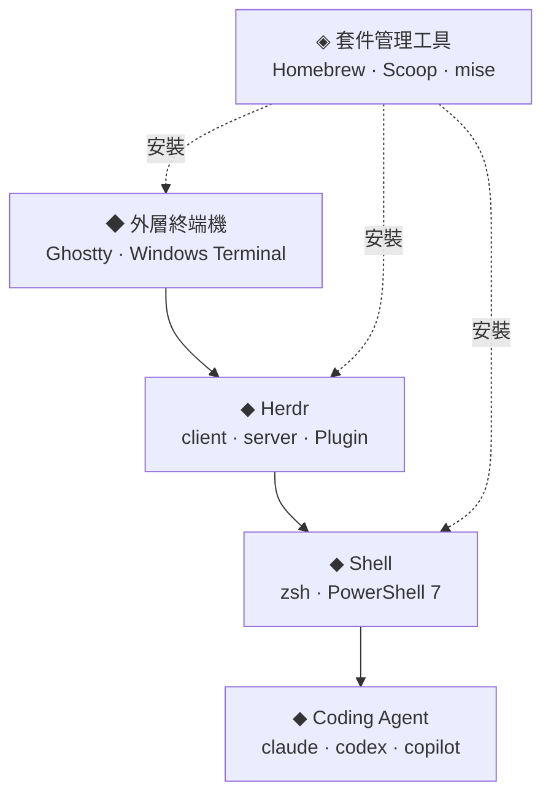

Herdr 是專為 Coding Agent 設計的終端機多工器。每個 Agent（Claude Code、Codex、GitHub Copilot CLI 等）都在真實的終端機 Pane 中執行，Herdr 會追蹤它是工作中、被阻擋還是已完成，而且關掉終端機視窗後整個 Session 依然存活。

本篇涵蓋所有機器上都一樣的部分：心智模型、日常按鍵、設定與 Plugin。平台設定另外拆成兩篇：

- [Herdr 在 macOS：Ghostty、Zsh 與 Homebrew](../herdr-terminal-macos/)
- [Herdr 在 Windows：Windows Terminal、PowerShell 7 與 Scoop](../herdr-terminal-windows/)

我實際的設定放在幾份持續更新的 Gist，所以這些筆記只記錄**重點與原因**，細節請以 Gist 為準。

---

## Herdr 位於哪一層

**Herdr 不會取代你的終端機設定，而是疊在它上面。** 字型不對、快速鍵被吃掉、或是 Shell 只有手動開啟時才正常，這些問題會在每個 Pane 裡出現，再乘上你同時執行的 Agent 數量。



| 層次 | 職責 | 忽略時的症狀 |
| :--- | :--- | :--- |
| 外層終端機 | 字型、按鍵傳遞、圖形 | 亂碼圖示、出現 `;3D`、快速鍵被吃掉 |
| Herdr | Pane、Agent 狀態、Session 持久化 | 側邊欄難讀、無法還原狀態 |
| Shell | 環境變數、`PATH`、Prompt | Agent 執行時找不到工具 |
| 套件管理工具 | 可重現的安裝 | 每台機器各自漂移 |

多數「Herdr 好像怪怪的」問題，其實出在被責怪那一層的下一層。這些下層設定由兩篇平台筆記說明。

---

## 安裝

用你已經在用的套件管理工具安裝，且每台機器請**只選一種**來源：

```bash
brew install herdr      # macOS（Homebrew）
scoop install herdr     # Windows（Scoop，main bucket）
mise use -g herdr       # 任何平台（mise）
```

各平台也有直接安裝的指令稿，見[安裝頁面](https://herdr.dev/docs/install/)。`herdr update` 僅適用於直接安裝的版本；由套件管理工具安裝的版本必須用該工具升級，相容的執行中 server 會維持舊版本，而更新後的 client 可重新連線。只有需要 server 端的新功能時才重啟：`herdr server stop` 會終止 Pane 行程，請先完成或儲存執行中的工作。

在受管理的裝置上，先確認可使用的軟體安裝方式。Windows 的 Scoop 與 mise 通常安裝到使用者目錄；macOS 的 Homebrew prefix 必須先讓你的帳號可寫入，之後才能在不提權的情況下安裝一般 formula。部分企業環境提權可能需要額外申請，安裝程序要求管理員權限時應依環境規範處理。

---

## 心智模型

- **Workspace**：專案層級的最上層容器，每個儲存庫或任務各開一個。
- **Tab**：Workspace 內的版面，依 Agent、紀錄、伺服器、審查等用途分開。
- **Pane**：真實的終端機，每個 Pane 放 Agent 或 Shell。
- **Session**：持久化的 server 命名空間。預設的就夠用，完全隔離時才加具名 Session。
- **Client / server**：server 擁有 Pane，client 是介面。卸離 client，一切照常執行。

側邊欄會把每個 Agent 的狀態顯示為下列其中一種：

| 狀態 | 意義 |
| :--- | :--- |
| `blocked` | 需要輸入、核准或決策 |
| `working` | 正在執行 |
| `done` | 已完成，而你還沒看過 |
| `idle` | 已完成或等待中，且已被看過 |
| `unknown` | 已偵測到 Agent，但無法可靠地判斷狀態 |

每個專案各用一個 Workspace，側邊欄才會維持可讀。優先處理 `blocked` 的項目。

---

## 第一次使用

```bash
cd ~/code/my-project
herdr            # 啟動或連上背景 Session
claude           # 在 Pane 中執行 Agent；Herdr 會自動偵測
```

關掉終端機，或按 `prefix+q` 卸離。server 與所有 Agent 會繼續執行；再次執行 `herdr` 即可重新連上。`herdr server stop` 會終止 Pane 行程；下次啟動會還原儲存的版面，而非讓原行程繼續存活。

Herdr 以滑鼠操作為先，所以一開始可以直接點選與拖曳，鍵盤層是選用的。預設的 Prefix 是 `ctrl+b`：按下、放開，再按動作鍵。

| 動作 | 按鍵 |
| :--- | :--- |
| 新增 Tab | `prefix+c` |
| 向右 / 向下分割 | `prefix+v` / `prefix+minus` |
| 在 Pane 之間移動 | `prefix+h/j/k/l` |
| Workspace 導覽 | `prefix+w` |
| 卸離 | `prefix+q` |
| 顯示所有綁定 | `prefix+?` |

> [!TIP]
> `prefix+g` 會開啟 Goto 選單，依 Workspace 列出每個 Agent 與終端機。在選單中按 `b` 可只篩出被阻擋的 Agent。

### 遠端工作

- **先 SSH 再執行 Herdr**：`ssh you@server` 後執行 `herdr`。行為就像那台機器上的 tmux，也適用於手機的 SSH 用戶端。
- **`herdr --remote <host>`**：以本機介面連上遠端 Session，並支援本機剪貼簿圖片貼上。
- **儲存的機器**：`herdr machine add <host> --label <label>` 可在同一個視窗中管理多台機器。

---

## Integration

Herdr 結合行程偵測、終端機輸出與 Integration 回報，辨識 Agent 及其狀態。若希望支援在 server 重啟後恢復*同一段*對話，請為受支援的 Agent 安裝目前版本的 Integration：

```bash
herdr integration install claude
herdr integration install codex
herdr integration status
```

[Agents 頁面](https://herdr.dev/docs/agents/)列出完整的支援清單，以及哪些 Agent 會自行回報狀態。Windows 支援的 Integration 範圍比 macOS 與 Linux 窄。

| 能保留什麼 | 行程持續執行 | 版面恢復 | Agent 對話恢復 |
| :--- | :---: | :---: | :---: |
| 卸離後重新連上 | 是 | 是 | 是 |
| server 重啟 | 否 | 是 | 需有有效的原生 Session reference，並啟用還原 |

還原也需要目前版本的 Integration 回報有效的 Session reference，且 `[session] resume_agents_on_restore = true`（預設值）。僅完成安裝不代表一定能還原；不支援或過時的 reference 會回到一般 Shell。詳見[對話還原](https://herdr.dev/docs/session-state/#native-agent-session-restore)。

---

## 值得保留的設定

我的 [Herdr Gist](https://gist.github.com/akunzai/5fca04af65c7ce705be190135191e8e9) 很精簡，各平台共用，重點是 `config.toml`（在 macOS 位於 `~/.config/herdr/config.toml`）。換新機器時我會帶走這些部分：

| 設定 | 原因 |
| :--- | :--- |
| `[theme] name = "catppuccin"` | 與 Prompt 一致，側邊欄對比穩定 |
| `[ui] status_indicators = "symbols"` | Agent 狀態一目了然，不必靠顏色辨識 |
| `[ui] show_agent_labels_on_pane_borders = true` | 縮小檢視時仍知道 Pane 屬於哪個 Agent |
| `[ui.sound] enabled = true` | Agent 完成或被阻擋時聽得到，再切換回去 |
| `[[keys.command]]` 項目 | 把 Plugin 動作綁到 `prefix+...` 快速鍵 |

不用 Prefix 的組合鍵在 `ctrl+alt` 上最穩定，因為終端機與桌面環境幾乎不會佔用它。綁定其他組合前，請先查閱[鍵盤指南](https://herdr.dev/docs/keyboard/)。

### Plugin

Plugin 是依機器各自安裝，並記錄在 `plugins.json` 中。該檔案包含絕對路徑，請當作參考，不要直接複製。

| Plugin | 用途 | macOS | Windows |
| :--- | :--- | :---: | :---: |
| [herdr-sidebar](https://github.com/alexarthurs/herdr-sidebar) | 檔案總管與版本控制 Pane | ✓ | ✓ |
| [herdr-hunk-diff](https://github.com/jhochenbaum/herdr-hunk-diff) | 檢視 Agent 的 diff 並把意見送回 Agent | ✓ | ✓ |
| [herdr-cache-hit](https://github.com/e-kotov/herdr-cache-hit) | 各 Agent 的 Prompt cache 命中率 | ✓ | 未宣告 |
| [terminal-browser](https://github.com/zenbu-labs/terminal-browser) | 在 Pane 內開啟瀏覽器 | ✓ | 未宣告 |

平台欄位依據各 Plugin 的 manifest。Herdr 對 Windows 的 Plugin 支援仍標示為 preview，請預期會有功能缺口。

---

## 給 Agent 用的 Herdr Skill

[`herdr` skill](https://github.com/herdrdev/herdr/tree/main/skills/herdr) 讓 Agent 快速了解如何操作 Herdr 本身。安裝後，在 Pane 內執行的 Agent 可以開啟並控制其他 Pane、分頁與 Workspace，常見用途如下：

- 開一個 Pane 執行 `ssh` 連到遠端主機，再送出指令並讀回輸出，協助遠端 SSH 操作。
- 在分割的 Pane 中執行 [terminal-browser](https://github.com/zenbu-labs/terminal-browser)，直接在終端機內操作網頁。
- 在新 Pane 啟動其他 harness CLI（Claude Code、Codex 等），交付任務並監看其狀態。

透過 [Skills CLI](https://github.com/akunzai/skills-manager) 安裝，並記錄在 `~/.agents/skills.json`：

```sh
skills add herdrdev/herdr --skill herdr
```

此 Skill 要求 Agent 在控制 Herdr 前檢查 `HERDR_ENV=1`，且僅在明確要求時使用。是否被發現或載入取決於 harness 與 Skill 的安裝方式；環境變數本身不會載入 Skill。若要操作網頁，請在安裝 Plugin 之外一併安裝 terminal-browser skill。

---

## 關於以 Gist 作為單一事實來源

我評估過直接把 Gist 內嵌到頁面中，最後決定不這麼做：

- 內嵌會在載入時引入第三方 JavaScript 來寫入頁面。沒有它就不會顯示內容，網站的搜尋也無法索引。
- Gist 會持續變動；文章中內嵌的快照，仍然會在讀者腦中變成過時的副本。
- 一個連結加上每項設定的*理由*，比設定本身更耐久。

因此請把 Gist 視為最新的實作，把這些筆記視為背後的思路。Gist 是個人設定，不是相容性規格。若它與筆記不一致，請先查閱已安裝版本的官方文件，再複製設定。

---

## 參考資料

- [Herdr：Quick start](https://herdr.dev/docs/quick-start/) — 第一次使用、滑鼠操作與基本按鍵
- [Herdr：Concepts](https://herdr.dev/docs/concepts/) — Workspace、Tab、Pane、Agent 狀態、Session 與模式
- [Herdr：How to work with Herdr](https://herdr.dev/docs/how-to-work/) — 本機、SSH、手機與 `--remote` 工作流程
- [Herdr：Session state and restore](https://herdr.dev/docs/session-state/) — 卸離、重啟與更新後能保留什麼
- [Herdr：Install](https://herdr.dev/docs/install/) — Homebrew、mise、Nix 與直接安裝，以及更新行為
- [Herdr：Keyboard](https://herdr.dev/docs/keyboard/) — Prefix 模型、預設鍵位與安全的免 Prefix 組合鍵
- [Herdr：Agents 與 Integrations](https://herdr.dev/docs/agents/) — 支援的 Agent 與 `herdr integration install`
